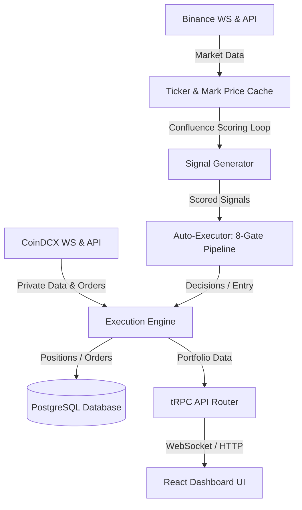

# Agent Knowledge Base & Repository Memory

Welcome! This document is the unified, single-source-of-truth knowledge base for AI agents working on the **Janus** trading repository. 

Always read this file before beginning work to orient yourself on the latest architecture, rules, and known patterns. Update the **Agent Memory & Changelog** section at the bottom of this file before finishing a task.

---

## 1. System Overview & Core Architecture

Janus is a full-stack algorithmic trading system and dashboard for CoinDCX Futures.

### Core Services
* **Confluence Scoring Loop**: Runs every 30s; evaluates multi-timeframe signals and updates the `signals` table.
* **Auto-Executor (`auto-executor.ts`)**: Evaluates signals against an 8-gate pipeline (kill switch, active cooling, dedup, risk limits, etc.). Triggers order execution.
* **Exit Manager (`exit-manager.ts`)**: Monitors open positions and executes exits when Take Profit (TP), Stop Loss (SL), or Trailing Stop conditions are met.
* **Streaming Cache (`streaming.ts`)**: Caches real-time prices from Binance and CoinDCX.

---

## 2. Trading Modes: Paper vs. Live

Janus supports two distinct modes: **Paper Mode** and **Live Mode**. These modes must remain strictly isolated.

* **Paper Mode** is active when `PAPER_TRADING=true` or `PLACE_ORDERS=false`.
  * Open positions are stored in the database (`positions` table with `is_paper = true`).
  * Real-time position tracking and balance/equity queries use a virtual paper wallet (`getPaperWallet()`) instead of Live Exchange endpoints.
  * Duplicate checking (Gate 3) and max positions count (Gate 4) query only paper positions (`eq(positions.isPaper, true)`).
* **Live Mode** is active when `PAPER_TRADING=false` and `PLACE_ORDERS=true`.
  * Connects directly to the CoinDCX API.
  * Queries and operations check only live positions (`eq(positions.isPaper, false)`).

---

## 3. Key Conventions & Symbol Normalization

### Symbol Format Differences
Different parts of the system use different formats. Always handle conversion properly:
* **Database Paper Format**: `B-BTC_USDT` (prefixed with `B-` and underscores).
* **Binance Ticker Format**: `BTCUSDT` (no hyphens, no underscores).
* **CoinDCX Live Format**: `BTCUSDT` (mapped via base and target precision details).
* **Helper**: Use the `mapPaperPosition(p, markets)` helper inside `trading-router.ts` to normalize paper positions, calculate real-time ROE and PnL, and resolve precisions.

### Precision Formatting
* Always import and use `formatPrice` and `formatQty` from `@/utils/precision` on the frontend.
* Retrieve base and target currency precisions from the `markets` metadata payload.

---

## 4. Database Schema Quick-Reference

* **`signals`**: Holds confluence scores, direction, symbol, threshold, and metadata.
* **`positions`**: Holds open/closed trades. Distinguishes modes with the `is_paper` boolean.
* **`trades`**: Execution history and fees.
* **`futures_wallets`**: Real-time margin and balances for Live mode.

---

## 5. Agent Memory Log & Changelog

Whenever you introduce a new feature, fix a bug, or change system behaviors, log it here.

### [2026-06-21] Scalping Removal & Typecheck Cleanup
* **Removed Scalping Setting**: Completely deprecated the `"scalping"` strategy from TypeScript configurations (`StrategyType` list, schemas, default tracking configurations, and `strategyTypeSchema` zod enum in [bot-router.ts](file:///home/nemesis/project/trading-workspace/janus/api/routers/bot-router.ts)). Added `"h6_momentum"` to Zod schemas to align with active momentum strategies.
* **Compilation and Database Enum Alignment**: Added `"h6_momentum"` to the database schema enum `strategyTypeEnum` in [schema.ts](file:///home/nemesis/project/trading-workspace/janus/db/schema.ts) to fix position insertion type mismatch errors.
* **Typecheck and Unused Variables Resolution**: Fixed duplicate `startDailyTrendScheduler` boot imports, corrected `PositionSide` check casing (`"LONG"`), added missing properties to `DEFAULT_CONFIG` static object in [auto-executor.ts](file:///home/nemesis/project/trading-workspace/janus/api/services/auto-executor.ts), and scrubbed unused local imports/variables to guarantee a zero-error compile state.

### [2026-06-21] Trailing Activation Gate, Short Breakeven SL, and H6 Momentum Strategy
* **Trailing Stop-Loss Gate**: Added a dynamic activation gate using `tp1ActivationThresholdPct` in [trailing-stop.ts](file:///home/nemesis/project/trading-workspace/janus/api/services/trailing-stop.ts) to prevent stops from tightening on noise immediately after entry.
* **Short Breakeven Fix**: Standardized short position breakeven calculation in [ai-advisor.ts](file:///home/nemesis/project/trading-workspace/janus/api/services/position-manager/ai-advisor.ts) to lock stop loss below entry price. Moved the trailing engine breakeven trigger to 1:1 Risk-to-Reward (1R).
* **Asymmetric 70/30 Capital Sizing**: Implemented a 1.4× long / 0.6× short multiplier in [auto-executor.ts](file:///home/nemesis/project/trading-workspace/janus/api/services/auto-executor.ts) to capture digital asset upward drift.
* **6-Hour Momentum Configuration**: Added `h6_momentum` strategy type, limits, and configurations to [strategy-config.ts](file:///home/nemesis/project/trading-workspace/janus/api/services/strategy-config.ts) and [trailing-stop.ts](file:///home/nemesis/project/trading-workspace/janus/api/services/trailing-stop.ts).
* **Schema Correction**: Restored `uq_positions_open` unique partial index in [schema.ts](file:///home/nemesis/project/trading-workspace/janus/db/schema.ts) to align with DB migrations and fix auth-enforcement tests.

### [2026-06-21] Active Surveillance Dashboard Layout
* **Surveillance Layout Page**: Created `src/pages/Surveillance.tsx` featuring high-density cyberpunk-style charts, dynamic simulator controls (Bullish vs Bearish reversals), custom SVG candle grids, Monte Carlo simulation paths, and the Confluence speedometer gauge.
* **Routing & Navigation Integration**: Registered `/surveillance` route inside `src/App.tsx` and added the Surveillance navigation item to the layout sidebar menu in `src/components/Layout.tsx` using the `Activity` icon.
* **Build Verification**: Verified typescript compilation via `npx tsc --noEmit` inside WSL to guarantee type-safety.

### [2026-06-06] AI Brain Infrastructure & Foundation (Phase A + B)
* **Risk Session Persistence**: Replaced in-memory `Map<number, RiskSession>` with PostgreSQL-backed `riskSessionStore`. `risk_sessions` table survives restarts, preserving cooldown, drawdown, and consecutive-loss state. Updated all call sites in `auto-executor.ts`, `trading-router.ts`, and `brain-governor.ts` to `await` the async store.
* **Exit Manager Safety Fix**: Removed Binance price fallback from `exit-manager.ts`. CoinDCX mark price is now the **only** price used for SL/TP/trailing decisions. Missing mark price logs a warning and skips evaluation rather than falling back to a different exchange.
* **Global SymbolSchema**: Added `SUPPORTED_SYMBOLS` and `SupportedSymbol` types to `contracts/constants.ts`. Added `validateSymbol()` helper to `brain-router.ts` that rejects unknown symbols at the API boundary.
* **Governor Extraction**: Created `api/services/governor.ts` containing the deterministic 8-gate safety logic extracted from `AutoExecutor`. AutoExecutor now delegates to `globalGovernor.evaluate()` after pre-fetching wallet data. This creates the clean insertion point `Signal → Governor → Brain → Executor`.
* **Market Regime Tracking**: Added `market_regimes` table, `api/services/market-regime-recorder.ts` (samples every 5 min), and tRPC endpoints (`market.regime`, `market.regimeHistory`). Regime snapshots are persisted for shared context across Signal Engine, Brain, Reflection, and Backtester.
* **Rule-Based BrainOrchestrator**: Rewrote `api/brain/brain-orchestrator.ts` to replace the LLM ReAct loop with deterministic heuristics (`BrainVerdict`: APPROVE, CAUTION, REDUCE_RISK, EXIT_NOW). Evaluates drawdown, signal confidence, regime alignment, recent episode performance, spread, and CVD confirmation. Always runs in shadow mode.
* **Decision Attribution**: Added `signalSource`, `brainVerdict`, `governorVerdict`, `governorGate`, `executionResult`, and `positionId` columns to `brain_episodes`. BrainOrchestrator populates these on every episode. AutoExecutor updates `executionResult` after execute/skip.
* **Brain Shadow Wiring**: AutoExecutor fires `brainOrchestrator.evaluate()` in parallel (non-blocking) after Governor approval. Brain verdict is stored in `brain_episodes` without affecting execution. Prepares the system for 500+ episode collection before any live veto authority.
* **pgvector Migration**: Replaced Qdrant with PostgreSQL + pgvector in `api/brain/brain-memory.ts`. Embeddings stored in `brain_episodes.embedding` (vector(1536)). Similarity search uses `embedding <=> query_vector` SQL. Removed Qdrant service from `docker-compose.yml`; Postgres image switched to `ankane/pgvector:latest`.
* **Brain Metrics Views**: Created SQL views `v_brain_expectancy`, `v_brain_regime_performance`, `v_brain_verdict_accuracy`, and `v_brain_signal_source_stats` in migration `0015`. Answer: "Would Janus have made more money if I listened to the Brain?"
* **LLM Reflection on Close**: Wired `reflectOnTrade()` into `handleExitSignal()` in `auto-executor.ts`. When a position closes, the system finds the associated `brain_episodes` row and triggers LLM-based post-trade analysis. Gated behind 20+ total episodes — below that threshold, a stub reflection is saved instead.
* **Candidate Rule Storage**: Fixed `brain-reflection.ts` to save LLM-extracted rules as `brain_candidate_rules` with `status="candidate"` instead of auto-appending them to active strategy prompts (which the expert reviews flagged as dangerous). Rules require backtest validation before promotion.
* **Evolution Gating**: Added `MIN_EPISODES_FOR_EVOLUTION = 500` gate to `brain-evolution.ts`. The nightly 02:00 evolution job skips until the episode corpus is large enough for statistically meaningful strategy mutation.

### [2026-06-06] LLM BrainOrchestrator — Full Autonomous Decision Engine
* **LLM-Powered Reasoning**: Rewrote `api/brain/brain-orchestrator.ts` to use Ollama (qwen3:4b-q8) with structured JSON output. The Brain gathers **all available context**: market snapshot, portfolio state, regime classification, episodic memory (pgvector similarity search), risk session, and signal metadata. Responds with `verdict`, `confidence`, `rationale`, `riskNotes`, and parameter adjustments.
* **Brain Authority in AutoExecutor**: Wired Brain verdict into the execution path in `auto-executor.ts`. When `brainGateEnabled=true` and `brainShadowMode=false`:
  - `EXIT_NOW` → trade vetoed (skip with `brain_veto` gate)
  - `CAUTION` → trade skipped (skip with `brain_caution` gate)
  - `REDUCE_RISK` → proceeds with Brain-adjusted size, stop-loss, and take-profit
  - `APPROVE` → proceeds normally
* **Deterministic Fallback**: If Ollama times out or returns bad JSON, the Brain falls back to the rule-based heuristic (drawdown, cooldown, regime, spread, CVD). Never crashes the execution path.
* **Config-Driven Authority**: Three flags in `auto_executor_config` control behavior:
  - `brainShadowMode` (default true) → log only, zero execution authority
  - `brainGateEnabled` → Brain can veto/modify trades after Governor approval
  - `brainDriverEnabled` → reserved for future autonomous signal generation
* **Governor Remains Final Gate**: Even when Brain has authority, the Governor runs a final safety check. Brain cannot override kill switch, max drawdown, or position limits. Architecture: `Signal → Governor → Brain → Governor → Executor`.

### [2026-06-06] Price Feed Robustness, Risk Engine Overrides & Default Leverage
* **Price Feed Safeguards**: Added zero and NaN filters to `latestTickerCache` and `markPriceCache` updates in `streaming.ts` and `coindcx-ws.ts` to prevent transient socket hiccups from seeding bad values.
* **Pricing Fallback Chains**: Modified position mapping and portfolio metrics on both the frontend (`Portfolio.tsx`) and backend (`trading-router.ts`) to fall back to the position's entry price if all real-time market feeds report 0 or NaN.
* **Risk Engine Manual Bypass**: Equipped `RiskEngine` and `checkTradeAllowed()` with a manual override parameter (`isManualOverride`) so that manually-injected signals from the dashboard bypass automated cooldowns, drawdown halts, and position size caps. Added warning logs in `auto-executor.ts` for audibility.
* **Default Leverage UI**: Changed the default leverage for manual signal injection in `BrainDashboard.tsx` from 3 to 10.

### [2026-06-07] Position Manager → Telegram Notifications
* **New service**: `api/services/position-telegram-notifier.ts` listens to the Position Manager event bus and sends automatic Telegram alerts for significant position events.
* **Events wired**: `position:discovered` (open), `position:closed` (exit with PnL), `position:action-executed` (partial exit, breakeven, trail, TP adjust, scale-in), `position:protected` (SL/TP set), `manager:error`, `manager:started`/`stopped`.
* **Intentionally ignored** (too noisy): `position:assessed` (every 30s), `position:synced` (every 10s), `KEEP_OPEN` actions.
* **Anti-spam**: 5-second debounce per position + global 3-second rate limit from `sendTelegramMessage`.
* **Wired into boot.ts**: Started after Telegram command bot; stopped on graceful shutdown.

### [2026-06-07] Position Transaction Ledger
* **New table**: `position_transactions` in `db/position-manager-schema.ts`. Immutable record of every material change to a position: `OPEN`, `SCALE_IN`, `PARTIAL_EXIT`, `FULL_EXIT`, `SL_UPDATE`, `TP_UPDATE`, `LIQUIDATED`.
* **Columns**: `positionId`, `userId`, `symbol`, `type`, `side`, `quantityBefore/After/Delta`, `price`, `avgEntryPrice`, `realizedPnl`, `fee`, `marginBefore/After`, `metadata` (JSON), `createdAt`.
* **Helper**: `api/services/position-manager/transaction-ledger.ts` with `recordPositionTransaction()` (best-effort, never throws) and `estimateFee()` (CoinDCX futures taker: 0.04%).
* **Wired into AutoExecutor**: `OPEN` transaction recorded after successful position creation (paper + live), including entry price, size, margin, fee estimate, signalId, strategyType, and exchangeOrderId.
* **Wired into Execution Manager**:
  - `PARTIAL_EXIT` / `REDUCE_SIZE`: records qty before/after/delta, exit price, realized PnL, fee, margin change
  - `FULL_EXIT`: records total qty, exit price, total realized PnL, fee, margin released
  - `MOVE_TO_BREAKEVEN` / `TRAIL_SL`: records `SL_UPDATE` with old→new SL and reason
  - `TIGHTEN_TP` / `EXTEND_TP`: records `TP_UPDATE` with old→new TP and reason
* **Use cases**: Tax reporting (every taxable exit event), audit trail (reconstruct full position lifecycle), PnL attribution (which partial exits were profitable), cost-basis tracking, paper mode parity (works without exchange fills).

### [2026-06-06] pgvector Migration & Deployment Runbook
* **Docker Image**: Switched `docker-compose.yml` from `postgres:16-alpine` to `ankane/pgvector:latest`. Both `postgres` and `pgbackup` services use the pgvector image so embeddings work in the same DB.
* **Extension Creation**: After pulling the new image, run `CREATE EXTENSION IF NOT EXISTS vector;` inside the DB. Verified with `SELECT * FROM pg_extension WHERE extname = 'vector';`.
* **Manual Migration Path**: When `drizzle-kit` snapshot metadata collides with new migrations, bypass it entirely. Apply migrations manually with `docker compose exec -T postgres psql -U janus -d janus_production < db/migrations/0011_*.sql` (repeat for 0012–0015).
* **Data Compatibility**: The `pgdata` Docker volume is fully compatible — `ankane/pgvector:latest` is just PostgreSQL with the extension pre-installed. No data migration needed.
* **Post-Migration Verification**: Confirm `brain_episodes` has all new columns (`signal_source`, `brain_verdict`, `governor_verdict`, `governor_gate`, `execution_result`, `position_id`, `embedding`) with `\d brain_episodes`.

### [2026-06-06] Observability, Performance Reporting & Brain Reconciliation
* **Decision persistence**: New `executor_decisions` table — every auto-executor `execute`/`skip` is persisted with a `gate` label (target_list, dedup, risk, correlation, llm, executed, …). Survives restart. Exposed via `bot.decisions` + `bot.decisionStats` (gate breakdown) + live `bot.decisionStream`.
* **Config cache-bust**: `AutoExecutor.invalidateConfigCache()` is called from `autoExecutor.saveConfig`, `bot.start/stop/setLLMFilter`, and `brain.setBrainMode` so UI changes hit the running executor immediately (no 30s cache lag).
* **Brain config**: `auto_executor_config` gained `brainDriverEnabled`, `brainGateEnabled`, `brainShadowMode` (toggle the inline shadow brain from the UI). tRPC `brain` router added: `episodes/reflections/strategies` queries, live `decisionStream` (via `brainEvents` on the orchestrator), `getBrainMode`/`setBrainMode`.
* **Performance report**: `performance.systemReport({ isPaper, lastNTrades?, sinceDays? })` — headline (winRate, net PnL, expectancy, profit factor, max drawdown, avg win/loss, avg hold), attribution **bySource** (brain/confluence/manual via `positions.signalId → signals.metadata.source`), bySymbol, byStrategy, brainQuality (enter/hold/executed/vetoed), and a cumulative-PnL equity curve. UI: `SystemReportPanel` (in PerformanceDashboard) + `BrainControlPanel` (in BrainDashboard).
* **LLM stream fix**: `llmDecisionEvents` moved to `services/llm-events.ts`; `auto-executor.logLlmDecision` now emits it so `llm.decisionStream` is live. Added `llm.acceptRate`.
* **Reconciliation note**: The earlier standalone "brain driver" loop and the brain-routing inside `llm-advisor` were removed in favour of the new inline `Signal → Governor → Brain.evaluate() → Executor` flow. The Brain (`brain-orchestrator.ts`) is the rule-based shadow evaluator; `llm-advisor.analyzeSignal` is the multi-key LLM entry filter again. `BrainVerdict` is a const-union (enums are banned under `erasableSyntaxOnly`).
* **Known follow-up**: `brain_episodes.embedding` (pgvector) is unmigrated — the `vector` extension is not installed on the host (`CREATE EXTENSION vector` fails). All other brain_episodes attribution columns exist; the brain does not yet write embeddings, so this is non-blocking. Install pgvector before enabling semantic memory.

### [2026-06-07] Currency Display Standardization (Rupee Symbol INR)
* **Rupee Symbol Priority**: Swapped currency symbols across the entire portfolio view to make INR (`₹`) the primary display for both Live and Paper trading modes, keeping USDT as secondary/subtext.
* **Portfolio Cards Refactoring**:
  - Live mode cards (Wallet Balance, Current Value, Unrealized PnL) now showcase the converted INR value in large bold font using the live `usdtInrRate` exchange rate, with secondary USDT details below it.
  - Paper mode virtual cards (Paper Wallet, Paper Equity, Paper PnL) similarly show INR values as primary.
  - Wallet balance subtexts (Available, Locked margin) now format and display converted INR as primary and USDT as subtext.
* **Positions & Trades Tables**:
  - Added a dedicated **SL / TP** (Stop Loss / Take Profit) column to the open positions table, showing Stop Loss in red (`text-j-down`) and Take Profit in green (`text-j-up`) using tabular figures.
  - Margin and Maintenance Margin columns calculate and show `₹` INR as primary, and `USDT` secondary.
  - Unrealized PnL column shows `₹` PnL as primary, and `USDT` PnL secondary, followed by ROE%.
  - Recent trades Total column converted to show primary `₹` INR, and secondary `USDT`.
* **Performance Dashboard & System Report**:
  - `PerformanceDashboard` metrics (Avg Win, Max Win, Avg Loss) and strategy breakdown tables display INR `₹` values as primary.
  - `SystemReportPanel` metrics (Net PnL, expectancy, avg win/loss) and attribution tables are updated to display converted INR `₹` values as primary.
### [2026-06-08] NaN Micro-Score & Short Breakeven SL Root-Cause Fix
* **NaN Micro-Score Bug (CRITICAL)**: `calculateMicroScore()` in `confluence.ts` produced `NaN` whenever the trade tape was empty (no trades in the window). The `else` branch divided `Math.abs(delta)` by `sellVolume`, and when both `delta` and `sellVolume` were `0`, JavaScript evaluates `0 / 0` as `NaN`. This corrupted the composite score, causing `direction = "neutral"` and silent signal drops. **Fix**: Added volume guards (`tradeTape.buyVolume > 0` and `tradeTape.sellVolume > 0`) before division; empty tape now safely leaves the score at baseline.
* **Short Breakeven SL Below Entry (CRITICAL)**: Three separate files calculated breakeven stop-loss for SHORT positions **below** the entry price (e.g., `entryPrice * 0.999`). For shorts, breakeven must be **above** entry (e.g., `entryPrice * 1.001`) to lock in profit. Having the stop below entry caused `shouldStopOut()` to trigger immediately on any price above the stop — which is always true right after entry. This explains why every short position opened in the last 24h was closed within 60 seconds with "Trailing stop hit".
  * `trailing-stop.ts:156` — changed `entryPrice * (1 - TAKER_FEE * 2)` → `entryPrice * (1 + TAKER_FEE * 2)`
  * `ai-advisor.ts:72` — changed `entryPrice * (isLong ? 1.001 : 0.999)` → `entryPrice * 1.001` for both sides
  * `execution-manager.ts:64-65` — changed ternary `0.999` fallback → unified `1.001`
* **Why No Positions Were Held**: The combination of (1) weak choppy-market scores keeping composites below threshold, and (2) the breakeven bug instantly killing the rare positions that did pass threshold, resulted in zero open positions for >30 minutes. The NaN bug additionally reduced the frequency of valid signals.

### [2026-06-07] Price Feed Robustness, Risk Engine Overrides & Default Leverage (Follow-up: SL/TP Scaling Fix)
* **SL/TP Scaling Fix**: Fixed a bug in `api/services/auto-executor.ts` where Stop Loss (`adjustedSlPct`) and Take Profit (`adjustedTpPct`) values generated by the AI Brain (whole percentage values, e.g. `1` for 1%, `3` for 3%) were not divided by 100 before entering price calculations. This previously resulted in stop losses being set to 0 (which fallback mechanisms reset to entry price) and take profits being set to 4x (400%) the entry price. They are now correctly divided by 100 to yield fractional decimal values (e.g. `0.01` and `0.03`).
* **Cross Margin Details 500 Fix**: Wrapped `crossMarginDetails` tRPC query in a `try/catch` block and `await`ed `getCrossMarginDetails` so that API errors (due to lack of credentials or exchange endpoint downtime) return `null` instead of throwing a 500 Internal Server Error.
* **SL/TP Sanity Guards**: Added multi-layer defensive validation in `auto-executor.ts` `calculateSizing()`:
  1. **Auto-detect misscaled percentages**: If `slPct` or `tp1Pct` > 1, treats them as whole percentages and divides by 100 (catches Brain output format mismatches).
  2. **Clamp to reasonable ranges**: SL clamped to 0.3–8%, TP clamped to 0.5–15% of entry price.
  3. **Side validation**: After calculation, verifies SL is on the correct side of entry (below for LONG, above for SHORT). Resets to minimum if violated.
* **Existing Position DB Fix**: Manually corrected BTCUSDT paper position #175 (and verified ETH #176 already closed) — TP was 4× entry (242423.20 → 62423.97) due to the pre-fix bug. SL set to breakeven+0.3% (60787.62) since trailing stop had already moved it.

### [2026-06-07] Binance Futures WS Blocked → REST Polling Primary + PM2 Watch Fix
* **Root Cause**: Bot stopped generating signals for ~8 hours. Diagnosis showed `market_data` table had no rows after a certain time. The Binance Futures production WebSocket (`fstream.binance.com`) was completely silent — opened successfully but received 0 messages in 30s tests. Testnet WS worked fine, Spot WS worked fine, and **Futures REST API worked fine**. Likely an IP-based rate limit or block from repeated reconnections (45 PM2 restarts).
* **Kline REST Polling (PRIMARY)**: Added `pollKlines()` in `api/services/streaming.ts` that calls `fetchKlines()` from **Binance USDⓈ-M Futures REST API** (`fapi.binance.com/fapi/v1/klines`) every 30s for each symbol. New closed candles are saved to `market_data` and emit `kline-update` events to trigger `runAnalysisForSymbol()`. A `lastKlineCloseTime` per-symbol deduplication map prevents duplicate events. This is now the **primary** signal-generation data path.
* **Mark Price / Funding REST Polling**: Added `pollMarkPriceAndFunding()` in `streaming.ts` that calls `fetchMarkPrice()` and `fetchFundingRate()` (Binance Futures REST) every 30s. This replaces the lost `@markPrice` WS stream and keeps `marketStateManager` funding data populated for the liquidity engine and confluence analysis.
* **Futures WS Kept**: `getBinanceWsUrl()` reverted back to `fstream.binance.com` with all futures streams (`@depth20@100ms`, `@trade`, `@ticker`, `@kline_1m`, `@forceOrder`, `@markPrice`). If the IP block ever lifts, the bot will automatically receive real-time WS data again. CoinDCX futures WS (`coindcx-ws.ts`) continues to provide mark prices as a secondary real-time source.
* **PM2 Watch Disabled**: Changed `ecosystem.config.cjs` `watch: ["dist", "api"]` → `watch: false`. The previous setting caused the bot to auto-restart on every file change in `api/` or `dist/`, leading to 45 restarts and likely triggering the Binance WS IP block. Trading bots must NEVER auto-restart mid-session; deploys should use explicit `pm2 reload`.
* **Kill Switch Cleanup**: Previous feed-failure kill switch (`3 WS feeds lost simultaneously`) was reset in DB and `kill-switch-state.json` was deleted so the new process starts clean.

### [2026-06-06] Trailing Stop-Loss & Breakeven Safety Hardening
* **Directional SL Guard (CRITICAL)**: Added `isSlImprovement()` in `execution-manager.ts` — LONG stop-loss can only move **up**, SHORT stop-loss can only move **down**. Applied to both `MOVE_TO_BREAKEVEN` and `TRAIL_SL`. Rejects backward moves silently with `"failed"` event emission.
* **Breakeven Spam Fix (CRITICAL)**: Added `breakevenApplied` boolean column to `positions` table. `policy-guard.ts` rejects `MOVE_TO_BREAKEVEN` if already applied. `ai-advisor.ts` code fallback skips breakeven recommendation when flag is set. `execution-manager.ts` sets `breakevenApplied: true` in DB on successful breakeven move.
* **Trailing-Stop Restart Safety (CRITICAL)**: `position-lifecycle.ts` now re-registers all open positions with the trailing-stop engine on every sync cycle, but only if they are **not already tracked** (`isPositionTracked()`). Prevents ratcheted stops from being overwritten by older DB values. Closed positions are unregistered via `unregisterPosition()` in the cleanup loop.
* **Duplicate Alert Deduplication (P1)**: Added `openedAlertSent` boolean column to `positions` table. `position-store.ts` only emits `position:discovered` when `openedAlertSent !== true`. `position-lifecycle.ts` flips the flag in DB **after** upserting and emitting, preventing lost alerts on crash. Telegram notifier already had defense-in-depth guard.
* **State Persistence (P1)**: `syncPositions()` now hydrates `breakevenApplied`, `extremePrice`, and `openedAlertSent` from DB into `ManagedPosition`. Added `strategyType` to `ManagedPosition` interface for trailing-stop registration.
* **Test Coverage**: Added `api/services/position-manager/__tests__/sl-guard.test.ts` with 6 Vitest cases covering LONG/SHORT improvement, null current SL, and strict inequality rejection.
* **Type Safety**: `policy-guard.ts` now imports `isSlImprovement` from `execution-manager.ts` instead of duplicating the logic. Event bus status values aligned to `"ok" | "failed"` union type.

### [2026-06-11] High-Fidelity Node.js Simulated Exchange Engine
* **Drizzle Schema Extension**: Added `orders` table to track simulated limit/stop/market order states (`PENDING`, `OPEN`, `FILLED`, `CANCELLED`, `REJECTED`). Pushed schema to database via Drizzle push and updated Relations mapping in `db/relations.ts`.
* **RiskManager Service**: Created `api/services/RiskManager.ts` enforcing a 10x leverage cap and standard liquidation target safety buffer using `decimal.js` arithmetic.
* **WalletLedgerService**: Created `api/services/WalletLedgerService.ts` utilizing pessimistic locking (`FOR UPDATE`) in database transactions to lock, release, refund margin, and charge fees with high precision `decimal.js` math.
* **MatchingEngine & BullMQ Worker**:
  - Created `api/services/MatchingEngine.ts` utilizing Redis sorted sets (`orders:trigger:buy:[symbol]` and `orders:trigger:sell:[symbol]`) to register limit/stop order triggers and match them against raw market ticks.
  - Created `api/workers/executionWorker.ts` containing the BullMQ processor that matches and executes simulated order fills asynchronously, inserting open positions, charging taker fees, recording to transaction ledger, and registering for trailing.
  - Integrated `MatchingEngine` evaluations directly into the primary trade tick stream in `api/services/streaming.ts`.
  - Wired the worker lifecycle into `api/boot.ts` so it boots on startup and shuts down gracefully.
* **Hono REST Integration**: Exposed the `/api/v1/orders/simulated` POST endpoint on Hono for simulated order placement, validating order properties via `RiskManager` and locking margin via `WalletLedgerService`.
* **ESBuild Bundle Externalization**: Added `--packages=external` to the esbuild compiler command in `package.json`. This keeps dependencies like `bullmq`, `ioredis`, and `postgres` external in the bundled output, resolving prototype mismatch errors and fixing `TypeError: Cannot read properties of undefined (reading 'client')` at runtime.

### [2026-06-11] Breakeven Crossing Fix & Symbol-Specific Risk Clamps
* **Breakeven Crossing Safeguard (CRITICAL)**: Added validation checks in both `policyGuard` (`policy-guard.ts`) and `executeAction` (`execution-manager.ts`) to ensure that stop-loss updates for `MOVE_TO_BREAKEVEN` and `TRAIL_SL` never cross the current mark price. This blocks dangerous stop loss updates (e.g. setting LONG stop-loss above the current mark price, or SHORT stop-loss below the current mark price) which previously caused immediate stop-outs.
* **Symbol-Specific Minimum Stop-Loss**: Centralized symbol-specific minimum stop-loss percentage configs in `contracts/constants.ts` (`SYMBOL_MIN_SL_PCT`), customized to matching volatility behaviors (e.g. DOGEUSDT: 0.50%, SOLUSDT: 0.40%, BTCUSDT: 0.25%, ETHUSDT: 0.30%, XRPUSDT: 0.30%). Integrated these symbol-specific constraints in the auto-executor sizing logic (`auto-executor.ts`) and the position manager stop-loss calculator (`sl-calculator.ts`).
* **Paper Take-Profit Retention**: Added `takeProfit` to the `orders` database schema (synchronized via `npm run db:push` and cleaned up unused imports in `db/schema.ts` to pass tsc check). Wired `takeProfit` preservation from the auto-executor enqueuing stage down to the execution worker, preventing paper positions from losing their target take profit value and forcing `ensureProtection` to recalculate it.

### [2026-06-12] Portfolio Page Live/Paper Isolation, Closed PnL Freeze & Margin/Precision Fixes
* **Closed Position PnL Freeze**: Fixed `PositionRow` component in `Portfolio.tsx` to check if a position's status is open. Closed or liquidated positions now display their frozen exit price and realized PnL from the database, rather than subscribing to and calculating from the live ticker stream.
* **Precision Formatting Fallback**: Integrated the `getPriceDecimals(symbol)` helper in the `PositionRow`'s Current price column so that closed positions (which lack a streamed `basePrecision` field) default to their symbol-specific decimals (e.g., 4 for XRP, 5 for DOGE) instead of rounding down to 2 decimals.
* **Open Positions Logic Simplification**: Removed the redundant `allDbOpenPositions` query entirely. Extracted open positions by filtering directly from the real-time streamed `portfolio?.positions` property (using `!p.isPaper` for live, and `p.isPaper` for paper). This ensures paper open positions display with active, real-time ticker updates.
* **Tax Metrics Isolation**: Modified `closedPositions` and `liquidatedPositions` queries used in the India VDA tax estimator to explicitly pass `isPaper: false`. This ensures virtual paper trades do not affect real VDA tax computations.
* **Recent Trades Isolation**: Hidden the `Recent Trades` filled orders panel when viewing the Paper tab to prevent CoinDCX live trade logs from leaking into the Paper trading view.
* **Reconciler Margin Calculation Fix**: Fixed `position-reconciler.ts` so that auto-imported orphan positions have their margins computed as `(size * entryPrice) / leverage` when exchange-reported margin is missing or zero. Corrected the margin column of 469 existing positions in the database via a one-off migration script.

### [2026-06-12] Paper Capital Allocation, INR Margin Accounting & Pyramiding/Exits
* **INR/USDT margin bug (CRITICAL)**: Paper entries locked USDT margin amounts directly into INR `trading_accounts` (e.g. locked ₹7 instead of ₹705). Added `api/services/paper-currency.ts` with `usdtToWallet` / `walletToUsdt` helpers; all paper margin lock/release paths now convert consistently (`auto-executor`, `RiskManager`, `boot.ts` simulated orders, `execution-manager`, `paper-wallet` adapter).
* **Capital allocation increase**: Default paper allocation raised from 15% → **25%** (configurable up to 50% in Auto Trader UI). Removed hardcoded 15% sizing cap; paper trades can use up to **30%** of free equity per entry. Sizing now converts INR wallet balance to USDT before notional math.
* **Paper pyramiding (SCALE_IN)**: Position manager `SCALE_IN` now executes on paper — locks additional margin, updates weighted average entry, size, and ledger (`SCALE_IN` transaction). Policy guard scale-in threshold lowered to 15 USDT free margin; max single-position risk before scale-in raised to 40%.
* **Partial/full exit wallet fix**: Partial and full exits use `WalletLedgerService` via `releasePaperPositionMargin` (correct INR conversion). Position store syncs quantity/margin after partial exit. Manual `closePosition` releases paper margin. Governor duplicate gate now isolates paper/live and documents same-side scale-in path.

### [2026-06-12] Premium Dashboard Visual Upgrades & Typography pairing
* **Typography Refactoring**: Loaded `Inter` (sans-serif) for general UI labels, controls, actions and text descriptions. Defined `.font-mono` pointing to `JetBrains Mono` (monospace) for all numeric values, tickers, order book rows, and calculation stats to ensure perfect tabular alignment.
* **Glassmorphism & Depth**: Softened rigid solid borders (`#27272a` → `border-white/[0.06]`) and added background opacity layering across the top header and side panels.
* **Desktop Navigation & Collapsible Sidebar**: Added a collapsible navigation sidebar with smooth width transition (toggles `w-16` / `w-52` and persists state via `localStorage`). Icons show text labels and an expanded user profile block when open. Added a vertical green indicator strip (`bg-j-up`) that dynamically aligns to the left of the active sidebar navigation item. Styled connection feeds in the top bar into capsule tag badges ("Binance Feed", "CoinDCX Exec", "Live").
* **Ticker Tag Glow**: Replaced the solid active ticker border in the Ticker Strip with a glowing gradient badge (`border-amber-500/70 bg-amber-500/10 shadow-[0_0_8px_rgba(245,158,11,0.12)]`).
* **Tactile Inputs & Buttons**:
  - Replaced standard native HTML select dropdowns with a styled custom component with structured chevrons and hover animations.
  - Upgraded buy/sell action buttons to use linear gradients (`from-j-up to-j-up/90` and `from-j-down to-j-down/90`), subtle shadow accents, and active click shrink transitions (`active:scale-[0.98]`).
  - Implemented a collapsible right sidebar (toggles `w-80` / `w-0` and persists state via `localStorage`), featuring a floating chevron handle button centered on its left border for seamless folding to maximize chart workspace.
  - Added modern hover borders and ring focus highlights to strategy selectors and order input fields.
* **Telegram Priority Routing & Bug Fix**: Fixed a bug where disabling the "Enable Liquidity Alerts to Telegram" toggle blocked all Telegram messaging (price rules, structural signals, etc.). Refactored `broadcastTelegramAlert` to accept options. Standard alerts always deliver, while liquidity alerts are filtered except for high-conviction `SSS` sweeps (Buy-Side/Sell-Side Sweeps), which bypass the disabled toggle to prevent missing critical trend reversals.
* **Server Reload**: Recompiled the production backend bundle and gracefully restarted the `janus-bot` PM2 process to apply the updated priority-based Telegram filtering rules.
* **Colorblind theme support in Candles & Volume**: Fixed a bug where the chart's candles and volume bars ignored the selected colorblind-safe/Binance theme (remained green and red) when the "Default" candle intensity (heat) mode was active. Wired the theme's custom up/down color hexes into `getIntensityColor` and added a dependency repaint `useEffect` to dynamically redraw candles and volume bars on theme switches.
* **Orphan Live Position Reconciliation Isolation**: Fixed a bug where the position reconciler auto-imported live positions from the exchange as orphans (`isPaper: false`) even when the bot was running in Paper mode. Because the bot was in Paper mode, it couldn't place live close orders on the exchange, but the exit manager virtually closed them in the DB, causing the reconciler to re-import the open live position every 5 minutes and bloating the "Closed" list with 600+ duplicate live positions. Wrapped orphan live position auto-import in an `env.placeOrders` check, deleted the initial 635 duplicate rows, and performed a final cleanup to remove the remaining 81 legacy closed orphan positions from the database, fully restoring the Live Closed portfolio view.
* **Chart Visibility Auto-Backfill**: Added a `visibilitychange` listener to `Dashboard.tsx`. When the browser tab regains focus (goes from hidden to visible after being in the background), it automatically invalidates and refetches the `klines` query. This resolves the issue where switching tabs throttled/suspended websocket streams and left a gap of missing candles on the chart.
* **Price Axis Label Clashing & Countdown Overlay Fix**: Hid bid/ask labels from the right-hand price scale axis (`axisLabelVisible: false`) to avoid axis congestion, drawing them as dashed lines on the canvas with the calculated spread appended to the `ASK` line label (e.g., `ASK (Spread: 0.01)`). Disabled the default candlestick series price line. Added a custom price line labeled `"LAST"` on the axis (with dynamic up/down theme color) and integrated the countdown timer directly into its title (e.g., `LAST (05:52)`) using `lineWidth: 0`. Created `LastPriceLinePrimitive` to render a partial price line on the canvas that starts from the last price axis on the right and stops exactly at the center of the current forming candle, ending with a solid dot and an outer glow ring, smooth-lerping inside the animation loop.

### [2026-06-14] Kronos Signals UI on Signals Page
* **`src/lib/kronos-display.ts`**: Shared helpers for normalizing symbols, parsing `metadata.kronos`, resolving live vs snapshot forecasts, and bias classification.
* **`src/pages/Signals.tsx`**: Per-card `KronosBadge` (direction, confidence, vol forecast, score boost) mirrors KNN badge pattern. Live strip shows all tracked symbols. Hydrates from `trpc.signal.kronosLatest` on mount + `trpc.signal.kronosStream` for real-time updates. Cards merge live forecast with historical `metadata.kronos` boost (boost stays tied to the signal that produced it).

### [2026-06-14] Kronos Startup Kline Backfill & Log Spam Fix
* **Root cause**: `bootstrapHistoricalKlines()` was fire-and-forget while `subscribeToSymbol()` immediately polled only 5 candles and triggered confluence/Kronos analysis — producing dozens of `[kronos] Insufficient klines` warnings on every boot.
* **`signal-engine.ts`**: `startAutoAnalysis()` now `await`s bootstrap before subscribing to WS streams. Bootstrap upserts 150×1m + 100×1h candles per symbol (regime detector uses 1h Kronos) with `onConflictDoUpdate` and per-symbol success logs.
* **`kronos-client.ts`**: When DB has < 50 candles, falls back to Binance REST `fetchKlines()` instead of returning null. Warning logs are throttled to once per symbol+interval per 5 minutes. Symbol normalization (`B-ETH_USDT` → `ETHUSDT`) applied consistently to cache and inference queries.

### [2026-06-14] Symmetrical Side-by-Side Depth Book UI Refinement & Vol/Depth Mode Toggle
* **Vol and Depth Visualization Modes**: Added a toggle switch capsule in the header (`vol` vs `depth`). `vol` renders individual level quantity bars scaled against the maximum visible quantity (`bid.qty/maxQty`, `ask.qty/maxQty`) to highlight order walls; `depth` renders cumulative volume fills (`bid.sum/totalBidVolume`, `ask.sum/totalAskVolume`) to showcase the overall liquidity structure.
* **Variable Color Intensity**: Replaced the static background bar opacity with a dynamic opacity range (`4%` to `30%`) styled inline based on the relative size of each level (`bid.qty/maxQty` or `bid.sum/totalBidVolume`). This visually distinguishes massive "liquidity walls" (bright, solid bars) from retail orders (faint, transparent bars).
* **Inline Liquidity Event Badges**: Integrated real-time price-specific liquidity events (e.g. pools, sweeps, and traps) directly onto the corresponding price rows in the book. Compact, color-coded tag badges (like `pool`, `void`, `trap`, etc.) render next to the level quantities.
* **Latest Event Alert Ticker**: Added a live feed alert banner at the bottom of the Depth Book displaying general market signals (like exhaustion or value area acceptance) in real-time, matching symbol contexts.
* **Full Available Depth (Math.max)**: Reverted the row iteration to map to `Math.max(bidsWithSum.length, asksWithSum.length)` as requested, ensuring the full depth of both books is displayed even if they have different number of levels.
* **Tailwind Opacity Fix**: Fixed a bug where the background depth volume bars were not displaying because `/8` (8% opacity) is a non-standard Tailwind opacity step. Changed `bg-j-up-bright/8` and `bg-j-down-bright/8` to `bg-j-up-bright/10` and `bg-j-down-bright/10` which compile and display correctly.
* **Lowercase & Divider Styling**: Refined the headers and sub-headers to use lowercase font-mono layout (`bid | ask`, `amt price | price amt`) matching user design instructions, separated by a crisp, continuous center divider line (`border-r border-[#27272a]`).

### [2026-06-16] Telegram Liquidity & Liquidation Alert Gating
* **Liquidation monitor**: Removed Telegram sends from `liquidation-monitor.ts` — proximity critical/warning events stay in logs + `liquidationMonitorEvents` only.
* **Liquidity engine**: `LONG_LIQUIDATION_CASCADE` / `SHORT_LIQUIDATION_CASCADE` no longer route to Telegram. Removed high-priority sweep bypass — when `telegramLiquidityAlertsEnabled=false`, **all** liquidity alerts are blocked.
* **`broadcastTelegramAlert`**: Dropped `isHighPriority` option; liquidity gate is now a hard check on `telegramLiquidityAlertsEnabled`. Skips DB fetch when circuit breaker is open.

### [2026-06-16] Telegram Network Circuit Breaker & Log Spam Fix
* **Root cause**: `api.telegram.org:443` is unreachable from the host network (connect timeout `UND_ERR_CONNECT_TIMEOUT`). Liquidity/alert engines kept calling `sendTelegramMessage`, each waiting ~10s and logging a full stack trace — flooding PM2 logs.
* **`api/services/telegram.ts`**: Added network circuit breaker with exponential backoff (60s → 30m cap). Failed sends and polling errors open the circuit; successful send closes it. Error logs throttled to once per 5 minutes. Connect timeout shortened to 5s via `AbortSignal.timeout`. Exported `isTelegramPaused()`, `recordTelegramNetworkFailure()`, `getTelegramApiBase()`.
* **`api/services/telegram-bot.ts`**: Polling skips when circuit is open; poll network failures feed the shared circuit breaker instead of logging every 3s.
* **Env**: `TELEGRAM_API_BASE` (default `https://api.telegram.org`) and `TELEGRAM_CONNECT_TIMEOUT_MS` (default `5000`) in `api/lib/env.ts` for local Bot API proxy setups.
* **Tests**: Circuit breaker open/skip/close behavior covered in `api/services/__tests__/telegram.test.ts`.

### [2026-06-17] Deterministic SMC Market Structure Engine
* **`api/services/price-action.ts`**: Rewrote swing labeling and BOS/CHoCH detection to follow confirmed swing-sequence rules. HH/LH/HL/LL now compare only consecutive same-type swings (first swing unlabeled). Structure breaks require initial HIGH→LOW→HIGH (or inverse) pattern before emitting events. Bullish BOS = close > last HH; bearish BOS = close < last LL; bearish CHoCH = bullish trend + close < last HL; bullish CHoCH = bearish trend + close > last LH. Added duplicate-break suppression per level.
* **`engine/src/application/analysis/market-structure-engine.ts`**: Mirrored the same state-machine logic; swing pivots now use strict `>`/`<` inequality (no tie qualifies). Trend derivation uses bar-accurate `deriveTrendFromStructure()`.
* **Tests**: Added deterministic HH/HL/BOS/CHoCH fixtures in `api/services/__tests__/price-action.test.ts`; flat-market pivot test updated in `engine/.../analysis-engines.test.ts`.

### [2026-06-17] Kill Switch 1-Hour Auto-Reset
* **`api/services/kill-switch.ts`**: Active kill switch now schedules automatic `reset()` after 1 hour (configurable via `KILL_SWITCH_AUTO_RESET_MS`, default `3600000`; set `0` to disable). On server boot, expired halts from DB/file are cleared immediately; remaining TTL is rescheduled. Manual reset cancels the timer.
* **`auto-executor-router.ts`**: `killSwitchStatus` exposes `autoResetAt` epoch for UI countdown.
* **`KillSwitchButton.tsx`**: HALTED badge shows minutes until auto-resume.
* **Tests**: Auto-reset TTL cases in `api/services/__tests__/kill-switch.test.ts`.

### [2026-06-17] Resolved Trade Halting & 50% Capital Allocation Alignment
* **Trade Halting Root-Cause Fix**: Resolved a conflict where automated signals calculated a position size of 30% (`capital_allocation_pct = 0.300`), which violated the Risk Engine's default 20% cap (`maxPositionPct = 0.20`), causing the Governor to skip all trades at Gate 7 (Risk).
* **50% Capital Allocation**: Updated the database configuration `capital_allocation_pct` to `0.500` (50%) for user 1, and aligned the Risk Engine's default limit `DEFAULT_RISK_CONFIG.maxPositionPct` to `0.50` (50%).
* **Dynamic Sizing Alignment**: Added logic to `governor.ts` that dynamically scales `globalRiskEngine.config.maxPositionPct` to be at least `allocPct * 1.05` on every evaluation, preventing self-blocking in the future if capital allocation is set higher than the risk cap.
* **Bypass Flags**: Implemented `DISABLE_KILL_SWITCH` and `DISABLE_RISK_LIMITS` environment variables in `governor.ts` and `.env` (both set to `true`) to allow the user to completely disable safety gates.
* **Node 18 Compatibility**: Replaced all uses of `import.meta.dirname` (unsupported in Node 18, which caused bot startup crashes) with ES Module standard `path.dirname(fileURLToPath(import.meta.url))` in `boot.ts` and `vite.ts`.

### [2026-06-18] Paper Margin Currency Normalization (PnL / ROE / Exits)
* **`paper-currency.ts`**: Central helpers `computeMarginUsdt`, `resolvePaperPositionMargin`, legacy INR/USDT detection, and wallet/USDT converters.
* **`executionWorker.ts`**: Stores margin in wallet currency (fixed earlier).
* **`trading-service.ts`**, **`Portfolio.tsx`**: Display + ROE use normalized wallet/USDT margin.
* **`position-lifecycle.ts`**, **`position-store.ts`**, **`policy-guard.ts`**: ROE/risk/margin totals derive from USDT margin math, not raw DB field.
* **`execution-manager.ts`**, **`auto-executor.ts`**, **`trading-router.ts`**: Paper exits/partial/scale-in always pass USDT amounts to `releasePaperPositionMargin` / `lockPaperPositionMargin`.
* **`position-reconciler.ts`**: Repairs legacy mis-stored margin rows on reconcile.

### [2026-06-18] Paper Position Margin Display Fix (INR Currency Mismatch)
* **`executionWorker.ts`**: Paper positions now store `margin` in wallet currency (INR via `usdtToWallet`) instead of raw USDT amount with `marginCurrency: INR`. Fees charged in wallet currency too.
* **`trading-service.ts`**: `mapPaperPosition()` converts legacy mis-stored USDT margins to INR for display when `margin ≤ notional/leverage`.
* **`position-reconciler.ts`**: Paper margin reconciliation uses stored wallet-currency amounts; auto-repairs legacy INR-labelled USDT margin rows on reconcile cycle.

### [2026-06-18] Leverage Range 5x–20x, Intraday 15x, Kronos Override Removed
* **`contracts/constants.ts`**: Added `MIN_SYSTEM_LEVERAGE` (5), `MAX_SYSTEM_LEVERAGE` (20), and `clampSystemLeverage()`.
* **`strategy-config.ts`**: `intraday.maxLeverage` raised to **15x**.
* **`auto-executor.ts`**: Removed Kronos volatility leverage cap (`Math.min(leverage, 2)`); all entries clamped via `clampSystemLeverage()`. Kronos still scales conviction on direction agreement only.
* **`RiskManager.ts`**, **`trading-service.ts`**, **`auto-executor-router.ts`**, **`trading-account.ts`**: Hard caps raised from 10x → 20x.
* **UI**: Auto Trader presets `[5,7,10,15,20]`; Brain manual trigger capped at 20x.

### [2026-06-18] Adaptive Supertrend Lab — Live Kline Integration
* **Engine**: `src/lib/adaptive-supertrend.ts` — Kaufman ER adaptive supertrend with fee/slippage-aware backtest (0.08% RT cost, 1% risk sizing), trade log, Sharpe, profit factor, max consecutive wins/losses.
* **Historical fetch**: `fetchKlinesPaginated()` in `api/services/binance.ts`; tRPC `market.klinesBatch` + `market.klinesHistorical` for date-range pagination through Janus backend (no browser CORS).
* **UI**: `/adaptive-st` — 20 symbols, 14 intervals, date presets (1D–1Y), Fetch & Run workflow, pan/zoom chart viewport, volume panel, trade log table, expanded backtest sidebar stats, Pine v6 export with commission/slippage.
* **Nav**: Sidebar "Adaptive ST" entry.
* **Tests**: `api/services/__tests__/adaptive-supertrend.test.ts`.

### [2026-06-18] Telegram TimeoutError Circuit Breaker
* **`telegram.ts`**: `AbortSignal.timeout()` throws `DOMException TimeoutError` — now treated as a network failure (opens circuit, no full stack trace). Transient send errors log message only.
* **`position-telegram-notifier.ts`**: Skips DB lookup when `isTelegramPaused()`.

### [2026-06-18] Manual Signal Injection Fix (INR Equity Sizing + Gate Bypasses)
* **`BrainDashboard.tsx`**: Paper capital sizing now uses `equityUsdt` (INR wallet no longer treated as USDT — was sending ~$29,977 on a ~$1,000 account).
* **`paper-wallet.ts`**: Exposes `equityUsdt`, `balanceUsdt`, `freeMarginUsdt` for UI sizing.
* **`auto-executor.ts`**: Manual triggers bypass Brain veto (shadow log only), LLM advisor, and depth gate; manual `sizeUsdt` capped to available USDT equity server-side.
* **`governor.ts`**: Manual triggers bypass dedup window.
* **`brain-router.ts`**: Returns explicit 400 when executor never ran (`AUTO_EXECUTE` off, auto-trader disabled, kill switch) or when pipeline skips.

* **Ops**: Set `auto_executor_config.brain_shadow_mode = true` for user 1 (was `false` with `brain_gate_enabled=true`, causing 134+ `brain_veto` skips in 6h). `pm2 reload janus-bot` to clear config cache. Brain still evaluates/logs episodes; Governor-approved signals execute without Brain veto.
