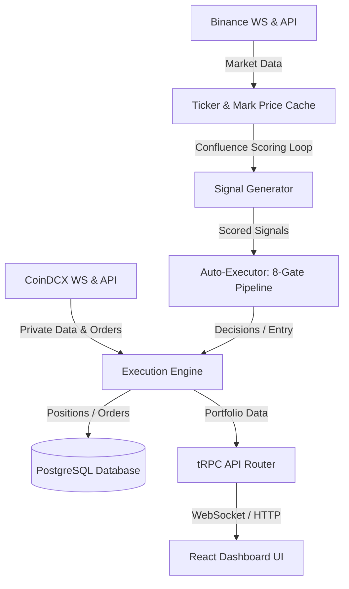

# Agent Knowledge Base & Repository Memory

Welcome! This document is the unified, single-source-of-truth knowledge base for AI agents working on the **Janus** trading repository. 

Always read this file before beginning work to orient yourself on the latest architecture, rules, and known patterns. Update the **Agent Memory & Changelog** section at the bottom of this file before finishing a task.

---

## 1. System Overview & Core Architecture

Janus is a full-stack algorithmic trading system and dashboard for CoinDCX Futures.

### Core Services
* **Confluence Scoring Loop**: Runs every 30s; evaluates multi-timeframe signals and updates the `signals` table.
* **Auto-Executor (`auto-executor.ts`)**: Evaluates signals against an 8-gate pipeline (kill switch, active cooling, dedup, risk limits, etc.). Triggers order execution.
* **Exit Manager (`exit-manager.ts`)**: Monitors open positions and executes exits when Take Profit (TP), Stop Loss (SL), or Trailing Stop conditions are met.
* **Streaming Cache (`streaming.ts`)**: Caches real-time prices from Binance and CoinDCX.

---

## 2. Trading Modes: Paper vs. Live

Janus supports two distinct modes: **Paper Mode** and **Live Mode**. These modes must remain strictly isolated.

* **Paper Mode** is active when `PAPER_TRADING=true` or `PLACE_ORDERS=false`.
  * Open positions are stored in the database (`positions` table with `is_paper = true`).
  * Real-time position tracking and balance/equity queries use a virtual paper wallet (`getPaperWallet()`) instead of Live Exchange endpoints.
  * Duplicate checking (Gate 3) and max positions count (Gate 4) query only paper positions (`eq(positions.isPaper, true)`).
* **Live Mode** is active when `PAPER_TRADING=false` and `PLACE_ORDERS=true`.
  * Connects directly to the CoinDCX API.
  * Queries and operations check only live positions (`eq(positions.isPaper, false)`).

---

## 3. Key Conventions & Symbol Normalization

### Symbol Format Differences
Different parts of the system use different formats. Always handle conversion properly:
* **Database Paper Format**: `B-BTC_USDT` (prefixed with `B-` and underscores).
* **Binance Ticker Format**: `BTCUSDT` (no hyphens, no underscores).
* **CoinDCX Live Format**: `BTCUSDT` (mapped via base and target precision details).
* **Helper**: Use the `mapPaperPosition(p, markets)` helper inside `trading-router.ts` to normalize paper positions, calculate real-time ROE and PnL, and resolve precisions.

### Precision Formatting
* Always import and use `formatPrice` and `formatQty` from `@/utils/precision` on the frontend.
* Retrieve base and target currency precisions from the `markets` metadata payload.

---

## 4. Database Schema Quick-Reference

* **`signals`**: Holds confluence scores, direction, symbol, threshold, and metadata.
* **`positions`**: Holds open/closed trades. Distinguishes modes with the `is_paper` boolean.
* **`trades`**: Execution history and fees.
* **`futures_wallets`**: Real-time margin and balances for Live mode.

---

## 5. Agent Memory Log & Changelog

Whenever you introduce a new feature, fix a bug, or change system behaviors, log it here.

### [2026-06-06] Mode Separation, Manual Injections, & ROE Fixes
* **Manual Signal Injection**: Added a manual trigger form on `BrainDashboard.tsx` hitting `POST /api/brain/trigger-signal`. Bypasses default balance limits when a custom `sizeUsdt` override is present in the signal's `metadata`.
* **Toast Notifications**: Subscribed to portfolio stream in `ExitSignalToast.tsx` to show entry (`entryReason`) and exit (`exitReason`) toasts.
* **Exit Manager Update**: Changed `shouldExit` logic in `exit-manager.ts` so positions are not exited immediately upon clearing fees. They now run to actual TP/SL levels.
* **Real-time ROE Fixes**: Replaced static database-driven ROE display with dynamic real-time calculations:
  $$\text{ROE}\% = \frac{\text{Unrealized PnL}}{\text{Margin}} \times 100\%$$
  Implemented on both frontend (`Portfolio.tsx`) and backend mapper (`mapPaperPosition`).
