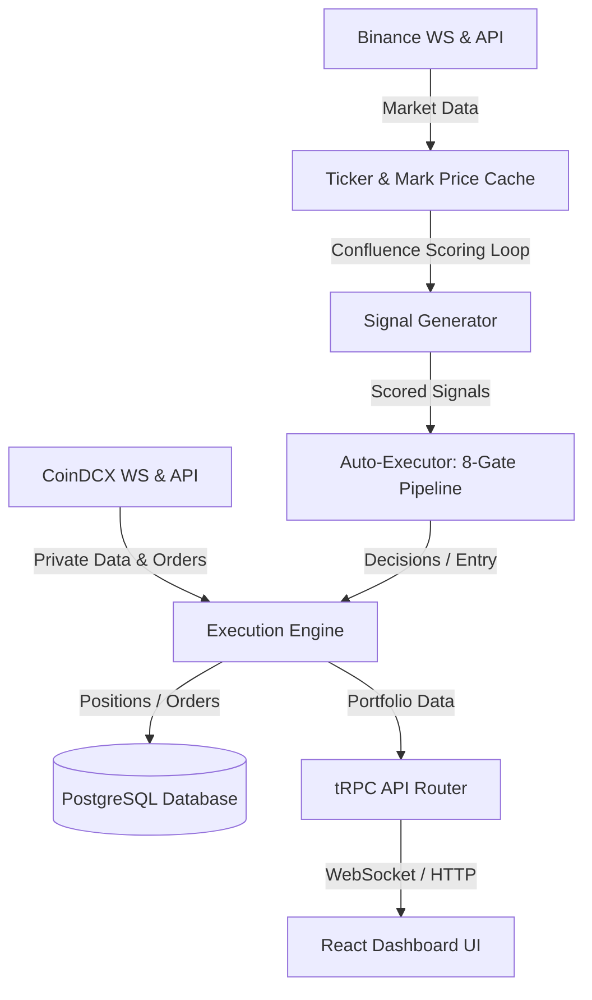

# Agent Knowledge Base & Repository Memory

Welcome! This document is the unified, single-source-of-truth knowledge base for AI agents working on the **Janus** trading repository. 

Always read this file before beginning work to orient yourself on the latest architecture, rules, and known patterns. Update the **Agent Memory & Changelog** section at the bottom of this file before finishing a task.

---

## 1. System Overview & Core Architecture

Janus is a full-stack algorithmic trading system and dashboard for CoinDCX Futures.

### Core Services
* **Confluence Scoring Loop**: Runs every 30s; evaluates multi-timeframe signals and updates the `signals` table.
* **Auto-Executor (`auto-executor.ts`)**: Evaluates signals against an 8-gate pipeline (kill switch, active cooling, dedup, risk limits, etc.). Triggers order execution.
* **Exit Manager (`exit-manager.ts`)**: Monitors open positions and executes exits when Take Profit (TP), Stop Loss (SL), or Trailing Stop conditions are met.
* **Streaming Cache (`streaming.ts`)**: Caches real-time prices from Binance and CoinDCX.

---

## 2. Trading Modes: Paper vs. Live

Janus supports two distinct modes: **Paper Mode** and **Live Mode**. These modes must remain strictly isolated.

* **Paper Mode** is active when `PAPER_TRADING=true` or `PLACE_ORDERS=false`.
  * Open positions are stored in the database (`positions` table with `is_paper = true`).
  * Real-time position tracking and balance/equity queries use a virtual paper wallet (`getPaperWallet()`) instead of Live Exchange endpoints.
  * Duplicate checking (Gate 3) and max positions count (Gate 4) query only paper positions (`eq(positions.isPaper, true)`).
* **Live Mode** is active when `PAPER_TRADING=false` and `PLACE_ORDERS=true`.
  * Connects directly to the CoinDCX API.
  * Queries and operations check only live positions (`eq(positions.isPaper, false)`).

---

## 3. Key Conventions & Symbol Normalization

### Symbol Format Differences
Different parts of the system use different formats. Always handle conversion properly:
* **Database Paper Format**: `B-BTC_USDT` (prefixed with `B-` and underscores).
* **Binance Ticker Format**: `BTCUSDT` (no hyphens, no underscores).
* **CoinDCX Live Format**: `BTCUSDT` (mapped via base and target precision details).
* **Helper**: Use the `mapPaperPosition(p, markets)` helper inside `trading-router.ts` to normalize paper positions, calculate real-time ROE and PnL, and resolve precisions.

### Precision Formatting
* Always import and use `formatPrice` and `formatQty` from `@/utils/precision` on the frontend.
* Retrieve base and target currency precisions from the `markets` metadata payload.

---

## 4. Database Schema Quick-Reference

* **`signals`**: Holds confluence scores, direction, symbol, threshold, and metadata.
* **`positions`**: Holds open/closed trades. Distinguishes modes with the `is_paper` boolean.
* **`trades`**: Execution history and fees.
* **`futures_wallets`**: Real-time margin and balances for Live mode.

---

## 5. Agent Memory Log & Changelog

Whenever you introduce a new feature, fix a bug, or change system behaviors, log it here.

### [2026-06-06] AI Brain Infrastructure & Foundation (Phase A + B)
* **Risk Session Persistence**: Replaced in-memory `Map<number, RiskSession>` with PostgreSQL-backed `riskSessionStore`. `risk_sessions` table survives restarts, preserving cooldown, drawdown, and consecutive-loss state. Updated all call sites in `auto-executor.ts`, `trading-router.ts`, and `brain-governor.ts` to `await` the async store.
* **Exit Manager Safety Fix**: Removed Binance price fallback from `exit-manager.ts`. CoinDCX mark price is now the **only** price used for SL/TP/trailing decisions. Missing mark price logs a warning and skips evaluation rather than falling back to a different exchange.
* **Global SymbolSchema**: Added `SUPPORTED_SYMBOLS` and `SupportedSymbol` types to `contracts/constants.ts`. Added `validateSymbol()` helper to `brain-router.ts` that rejects unknown symbols at the API boundary.
* **Governor Extraction**: Created `api/services/governor.ts` containing the deterministic 8-gate safety logic extracted from `AutoExecutor`. AutoExecutor now delegates to `globalGovernor.evaluate()` after pre-fetching wallet data. This creates the clean insertion point `Signal → Governor → Brain → Executor`.
* **Market Regime Tracking**: Added `market_regimes` table, `api/services/market-regime-recorder.ts` (samples every 5 min), and tRPC endpoints (`market.regime`, `market.regimeHistory`). Regime snapshots are persisted for shared context across Signal Engine, Brain, Reflection, and Backtester.
* **Rule-Based BrainOrchestrator**: Rewrote `api/brain/brain-orchestrator.ts` to replace the LLM ReAct loop with deterministic heuristics (`BrainVerdict`: APPROVE, CAUTION, REDUCE_RISK, EXIT_NOW). Evaluates drawdown, signal confidence, regime alignment, recent episode performance, spread, and CVD confirmation. Always runs in shadow mode.
* **Decision Attribution**: Added `signalSource`, `brainVerdict`, `governorVerdict`, `governorGate`, `executionResult`, and `positionId` columns to `brain_episodes`. BrainOrchestrator populates these on every episode. AutoExecutor updates `executionResult` after execute/skip.
* **Brain Shadow Wiring**: AutoExecutor fires `brainOrchestrator.evaluate()` in parallel (non-blocking) after Governor approval. Brain verdict is stored in `brain_episodes` without affecting execution. Prepares the system for 500+ episode collection before any live veto authority.
* **pgvector Migration**: Replaced Qdrant with PostgreSQL + pgvector in `api/brain/brain-memory.ts`. Embeddings stored in `brain_episodes.embedding` (vector(1536)). Similarity search uses `embedding <=> query_vector` SQL. Removed Qdrant service from `docker-compose.yml`; Postgres image switched to `ankane/pgvector:latest`.
* **Brain Metrics Views**: Created SQL views `v_brain_expectancy`, `v_brain_regime_performance`, `v_brain_verdict_accuracy`, and `v_brain_signal_source_stats` in migration `0015`. Answer: "Would Janus have made more money if I listened to the Brain?"
* **LLM Reflection on Close**: Wired `reflectOnTrade()` into `handleExitSignal()` in `auto-executor.ts`. When a position closes, the system finds the associated `brain_episodes` row and triggers LLM-based post-trade analysis. Gated behind 20+ total episodes — below that threshold, a stub reflection is saved instead.
* **Candidate Rule Storage**: Fixed `brain-reflection.ts` to save LLM-extracted rules as `brain_candidate_rules` with `status="candidate"` instead of auto-appending them to active strategy prompts (which the expert reviews flagged as dangerous). Rules require backtest validation before promotion.
* **Evolution Gating**: Added `MIN_EPISODES_FOR_EVOLUTION = 500` gate to `brain-evolution.ts`. The nightly 02:00 evolution job skips until the episode corpus is large enough for statistically meaningful strategy mutation.

### [2026-06-06] LLM BrainOrchestrator — Full Autonomous Decision Engine
* **LLM-Powered Reasoning**: Rewrote `api/brain/brain-orchestrator.ts` to use Ollama (qwen3:4b-q8) with structured JSON output. The Brain gathers **all available context**: market snapshot, portfolio state, regime classification, episodic memory (pgvector similarity search), risk session, and signal metadata. Responds with `verdict`, `confidence`, `rationale`, `riskNotes`, and parameter adjustments.
* **Brain Authority in AutoExecutor**: Wired Brain verdict into the execution path in `auto-executor.ts`. When `brainGateEnabled=true` and `brainShadowMode=false`:
  - `EXIT_NOW` → trade vetoed (skip with `brain_veto` gate)
  - `CAUTION` → trade skipped (skip with `brain_caution` gate)
  - `REDUCE_RISK` → proceeds with Brain-adjusted size, stop-loss, and take-profit
  - `APPROVE` → proceeds normally
* **Deterministic Fallback**: If Ollama times out or returns bad JSON, the Brain falls back to the rule-based heuristic (drawdown, cooldown, regime, spread, CVD). Never crashes the execution path.
* **Config-Driven Authority**: Three flags in `auto_executor_config` control behavior:
  - `brainShadowMode` (default true) → log only, zero execution authority
  - `brainGateEnabled` → Brain can veto/modify trades after Governor approval
  - `brainDriverEnabled` → reserved for future autonomous signal generation
* **Governor Remains Final Gate**: Even when Brain has authority, the Governor runs a final safety check. Brain cannot override kill switch, max drawdown, or position limits. Architecture: `Signal → Governor → Brain → Governor → Executor`.

### [2026-06-06] Price Feed Robustness, Risk Engine Overrides & Default Leverage
* **Price Feed Safeguards**: Added zero and NaN filters to `latestTickerCache` and `markPriceCache` updates in `streaming.ts` and `coindcx-ws.ts` to prevent transient socket hiccups from seeding bad values.
* **Pricing Fallback Chains**: Modified position mapping and portfolio metrics on both the frontend (`Portfolio.tsx`) and backend (`trading-router.ts`) to fall back to the position's entry price if all real-time market feeds report 0 or NaN.
* **Risk Engine Manual Bypass**: Equipped `RiskEngine` and `checkTradeAllowed()` with a manual override parameter (`isManualOverride`) so that manually-injected signals from the dashboard bypass automated cooldowns, drawdown halts, and position size caps. Added warning logs in `auto-executor.ts` for audibility.
* **Default Leverage UI**: Changed the default leverage for manual signal injection in `BrainDashboard.tsx` from 3 to 10.

### [2026-06-07] Position Manager → Telegram Notifications
* **New service**: `api/services/position-telegram-notifier.ts` listens to the Position Manager event bus and sends automatic Telegram alerts for significant position events.
* **Events wired**: `position:discovered` (open), `position:closed` (exit with PnL), `position:action-executed` (partial exit, breakeven, trail, TP adjust, scale-in), `position:protected` (SL/TP set), `manager:error`, `manager:started`/`stopped`.
* **Intentionally ignored** (too noisy): `position:assessed` (every 30s), `position:synced` (every 10s), `KEEP_OPEN` actions.
* **Anti-spam**: 5-second debounce per position + global 3-second rate limit from `sendTelegramMessage`.
* **Wired into boot.ts**: Started after Telegram command bot; stopped on graceful shutdown.

### [2026-06-07] Position Transaction Ledger
* **New table**: `position_transactions` in `db/position-manager-schema.ts`. Immutable record of every material change to a position: `OPEN`, `SCALE_IN`, `PARTIAL_EXIT`, `FULL_EXIT`, `SL_UPDATE`, `TP_UPDATE`, `LIQUIDATED`.
* **Columns**: `positionId`, `userId`, `symbol`, `type`, `side`, `quantityBefore/After/Delta`, `price`, `avgEntryPrice`, `realizedPnl`, `fee`, `marginBefore/After`, `metadata` (JSON), `createdAt`.
* **Helper**: `api/services/position-manager/transaction-ledger.ts` with `recordPositionTransaction()` (best-effort, never throws) and `estimateFee()` (CoinDCX futures taker: 0.04%).
* **Wired into AutoExecutor**: `OPEN` transaction recorded after successful position creation (paper + live), including entry price, size, margin, fee estimate, signalId, strategyType, and exchangeOrderId.
* **Wired into Execution Manager**:
  - `PARTIAL_EXIT` / `REDUCE_SIZE`: records qty before/after/delta, exit price, realized PnL, fee, margin change
  - `FULL_EXIT`: records total qty, exit price, total realized PnL, fee, margin released
  - `MOVE_TO_BREAKEVEN` / `TRAIL_SL`: records `SL_UPDATE` with old→new SL and reason
  - `TIGHTEN_TP` / `EXTEND_TP`: records `TP_UPDATE` with old→new TP and reason
* **Use cases**: Tax reporting (every taxable exit event), audit trail (reconstruct full position lifecycle), PnL attribution (which partial exits were profitable), cost-basis tracking, paper mode parity (works without exchange fills).

### [2026-06-06] pgvector Migration & Deployment Runbook
* **Docker Image**: Switched `docker-compose.yml` from `postgres:16-alpine` to `ankane/pgvector:latest`. Both `postgres` and `pgbackup` services use the pgvector image so embeddings work in the same DB.
* **Extension Creation**: After pulling the new image, run `CREATE EXTENSION IF NOT EXISTS vector;` inside the DB. Verified with `SELECT * FROM pg_extension WHERE extname = 'vector';`.
* **Manual Migration Path**: When `drizzle-kit` snapshot metadata collides with new migrations, bypass it entirely. Apply migrations manually with `docker compose exec -T postgres psql -U janus -d janus_production < db/migrations/0011_*.sql` (repeat for 0012–0015).
* **Data Compatibility**: The `pgdata` Docker volume is fully compatible — `ankane/pgvector:latest` is just PostgreSQL with the extension pre-installed. No data migration needed.
* **Post-Migration Verification**: Confirm `brain_episodes` has all new columns (`signal_source`, `brain_verdict`, `governor_verdict`, `governor_gate`, `execution_result`, `position_id`, `embedding`) with `\d brain_episodes`.

### [2026-06-06] Observability, Performance Reporting & Brain Reconciliation
* **Decision persistence**: New `executor_decisions` table — every auto-executor `execute`/`skip` is persisted with a `gate` label (target_list, dedup, risk, correlation, llm, executed, …). Survives restart. Exposed via `bot.decisions` + `bot.decisionStats` (gate breakdown) + live `bot.decisionStream`.
* **Config cache-bust**: `AutoExecutor.invalidateConfigCache()` is called from `autoExecutor.saveConfig`, `bot.start/stop/setLLMFilter`, and `brain.setBrainMode` so UI changes hit the running executor immediately (no 30s cache lag).
* **Brain config**: `auto_executor_config` gained `brainDriverEnabled`, `brainGateEnabled`, `brainShadowMode` (toggle the inline shadow brain from the UI). tRPC `brain` router added: `episodes/reflections/strategies` queries, live `decisionStream` (via `brainEvents` on the orchestrator), `getBrainMode`/`setBrainMode`.
* **Performance report**: `performance.systemReport({ isPaper, lastNTrades?, sinceDays? })` — headline (winRate, net PnL, expectancy, profit factor, max drawdown, avg win/loss, avg hold), attribution **bySource** (brain/confluence/manual via `positions.signalId → signals.metadata.source`), bySymbol, byStrategy, brainQuality (enter/hold/executed/vetoed), and a cumulative-PnL equity curve. UI: `SystemReportPanel` (in PerformanceDashboard) + `BrainControlPanel` (in BrainDashboard).
* **LLM stream fix**: `llmDecisionEvents` moved to `services/llm-events.ts`; `auto-executor.logLlmDecision` now emits it so `llm.decisionStream` is live. Added `llm.acceptRate`.
* **Reconciliation note**: The earlier standalone "brain driver" loop and the brain-routing inside `llm-advisor` were removed in favour of the new inline `Signal → Governor → Brain.evaluate() → Executor` flow. The Brain (`brain-orchestrator.ts`) is the rule-based shadow evaluator; `llm-advisor.analyzeSignal` is the multi-key LLM entry filter again. `BrainVerdict` is a const-union (enums are banned under `erasableSyntaxOnly`).
* **Known follow-up**: `brain_episodes.embedding` (pgvector) is unmigrated — the `vector` extension is not installed on the host (`CREATE EXTENSION vector` fails). All other brain_episodes attribution columns exist; the brain does not yet write embeddings, so this is non-blocking. Install pgvector before enabling semantic memory.

### [2026-06-07] Currency Display Standardization (Rupee Symbol INR)
* **Rupee Symbol Priority**: Swapped currency symbols across the entire portfolio view to make INR (`₹`) the primary display for both Live and Paper trading modes, keeping USDT as secondary/subtext.
* **Portfolio Cards Refactoring**:
  - Live mode cards (Wallet Balance, Current Value, Unrealized PnL) now showcase the converted INR value in large bold font using the live `usdtInrRate` exchange rate, with secondary USDT details below it.
  - Paper mode virtual cards (Paper Wallet, Paper Equity, Paper PnL) similarly show INR values as primary.
  - Wallet balance subtexts (Available, Locked margin) now format and display converted INR as primary and USDT as subtext.
* **Positions & Trades Tables**:
  - Margin and Maintenance Margin columns calculate and show `₹` INR as primary, and `USDT` secondary.
  - Unrealized PnL column shows `₹` PnL as primary, and `USDT` PnL secondary, followed by ROE%.
  - Recent trades Total column converted to show primary `₹` INR, and secondary `USDT`.
* **Performance Dashboard & System Report**:
  - `PerformanceDashboard` metrics (Avg Win, Max Win, Avg Loss) and strategy breakdown tables display INR `₹` values as primary.
  - `SystemReportPanel` metrics (Net PnL, expectancy, avg win/loss) and attribution tables are updated to display converted INR `₹` values as primary.

