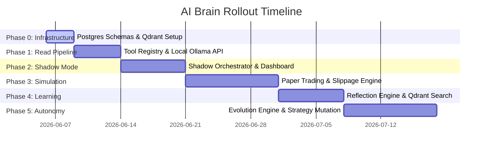

# Janus AI Brain: Step-by-Step Implementation Plan

This document details the step-by-step technical implementation plan for integrating the LLM-powered governed orchestration layer ("AI Brain") into the Janus PostgreSQL + Drizzle ORM codebase.

---

## Plan Overview & Execution Path

The rollout is divided into **6 strict phases** to ensure safety, minimize capital risk, and guarantee database compatibility with PostgreSQL.

---

## Phase 0: Database Schema & Vector DB Setup
**Goal**: Set up all PostgreSQL relational tables via Drizzle ORM and configure the Qdrant vector collection.

### 1. Target Files
* `db/schema.ts` (Drizzle schema definition)
* `src/brain/brain-memory.ts` (Vector initialization script)
* `docker-compose.yml` (Qdrant Docker configuration)

### 2. Action Items
* **Drizzle Schema Additions**: Add definitions for `brainEpisodes`, `brainStrategies`, `brainReflections`, `brainCandidateRules`, `brainActions`, `brainTools`, and `paperPositions` using PostgreSQL columns (`pgTable`, `bigserial`, `jsonb`, `timestamp`, `decimal`).
* **Vector Store Setup**: Update `docker-compose.yml` to spin up a local `qdrant/qdrant` container mapping port `6333`.
* **Collection Initialization**: Build `initVectorStore()` inside `src/brain/brain-memory.ts` to create the `janus_episodes` collection with `1536` dimensions (Cosine distance).

### 3. Verification Criteria
* Run `npm run db:generate` followed by `npm run db:push` to ensure tables are compiled and applied successfully without Postgres syntax errors.
* Execute `curl http://localhost:6333/collections` to verify Qdrant is running and the `janus_episodes` collection exists.

---

## Phase 1: Tool Registry & LLM Provider Connection
**Goal**: Establish connection to Ollama (running `qwen2.5:3b` or `gemma3:4b` locally) and implement read-only market/portfolio data wrappers.

### 1. Target Files
* `.env` / `.env.example`
* `src/brain/providers/ollama.ts` (Ollama REST connector)
* `src/brain/tool-registry.ts` (Data assembly layer)
* `src/brain/schemas.ts` (Zod schemas for LLM inputs and outputs)

### 2. Action Items
* **Ollama Client**: Implement a simple REST requester sending completion prompts to `http://localhost:11434/api/chat` with structured JSON format flags.
* **Registry Tool Wrappers**: Implement async read tools inside `tool-registry.ts`:
  * `getMarketSnapshot()`: Pulls price, volume, CVD, and SMC order blocks from `src/exchange/binance.ts`.
  * `getPortfolioSnapshot()`: Reads current wallet cash balance and open positions.
* **Prompt Engineering**: Define the base ReAct system prompt and save it to `src/brain/prompts/system.md`.

### 3. Verification Criteria
* Run a scratch unit test calling `runReAct("BTCUSDT")` to confirm that the local Ollama model responds in under `300ms` and returns a valid Zod-parsed `BrainDecision` structure.

---

## Phase 2: Shadow Mode Orchestrator & Live Monitoring
**Goal**: Run the orchestrator loop on live WebSocket events. Log proposed trade directions and display reasoning traces in the React frontend.

### 1. Target Files
* `src/brain/brain-orchestrator.ts` (Core signal processing loop)
* `src/routes/brain-router.ts` (Hono routes for frontend)
* `src/components/BrainDashboard.tsx` (React component)
* `src/components/BrainMemoryViewer.tsx` (React component)

### 2. Action Items
* **Signal Hook**: Intercept the exit point of the existing Janus Signal Engine. Pass the signal payload, current market ticks, and portfolio balance to the `BrainOrchestrator`.
* **Audit Logs**: For every signal received, run the LLM loop to output `BrainDecision`. Store this decision in the `brain_episodes` Postgres table, setting `actual_action = null` (Shadow Mode).
* **REST Endpoints**: Implement endpoints `/brain/health` and `/brain/episodes` in Hono.
* **UI Integration**: Mount the `BrainDashboard` under `/brain` route in the frontend and display live episode logs and thought steps.

### 3. Verification Criteria
* Trigger a mock trade signal. Ensure a new record is inserted into `brain_episodes` containing the JSON payload for market snapshots, thought processes, and decisions. Confirm that no live orders are dispatched.

---

## Phase 3: Paper Trading Engine & Slippage Simulator
**Goal**: Simulate execution offline, tracking account balances, margins, fees, and market fills.

### 1. Target Files
* `src/brain/adapters/execution-adapter.ts` (Interface)
* `src/brain/adapters/paper-adapter.ts` (Simulation execution logic)
* `src/brain/brain-governor.ts` (Deterministic safety checks)

### 2. Action Items
* **Heuristic Governor Rules**: Implement checking criteria in `brain-governor.ts`:
  * Block trade if WebSocket ticker latency >2 seconds.
  * Adjust sizes dynamically if portfolio drawdown exceeds 10%.
  * Apply price drift checks between exchange quotes.
* **Paper Executor**: Create the `PaperExecutionAdapter`. When the governor approves a trade, write a new row to `paper_positions` with simulated fees (0.05% taker) and slippage offsets.
* **WebSocket Execution loop**: Implement a ticker checker checking `paper_positions` status on every candle tick against Binance prices to trigger stop-loss (SL) or take-profit (TP) hits.

### 3. Verification Criteria
* Run the mock execution suite. Confirm that executing a `LONG` entry fills the position at `ticker_price + slippage`, reduces the simulated wallet balance by the transaction fee, and updates position stats correctly.

---

## Phase 4: Post-Trade Reflection & Vector Memory
**Goal**: Extract candidate rules after trade closes and search past events.

### 1. Target Files
* `src/brain/brain-reflection.ts` (Analysis worker)
* `src/jobs/reflection.job.ts` (Scheduler/worker trigger)

### 2. Action Items
* **Trade Close Event**: Hook into the `PaperExecutionAdapter`'s close action. Once a simulated position is closed, extract details (realized PnL, duration, R-multiple) and enqueue a reflection task.
* **LLM Reflection Call**: Invoke **Brain 4 (Trade Reflector)** with the prompt asking: *"What went right/wrong? Propose a structured rule."*
* **Rule Ingestion**: Save the extracted rule into the `brain_candidate_rules` PostgreSQL table.
* **Qdrant Indexing**: Compress the closed episode metadata and write it to Qdrant to enable semantic search on future setups.

### 3. Verification Criteria
* Close a position with a simulated loss. Check that a corresponding rule (e.g., *"Do not enter LONG if CVD is negative"*) is added to `brain_candidate_rules` and linked to the source episode.

---

## Phase 5: Offline Evolution Engine
**Goal**: Backtest candidate rules daily and promote valid rules to the live prompt template.

### 1. Target Files
* `src/brain/brain-evolution.ts` (Crossover, mutation, and evaluation logic)
* `src/brain/brain-scheduler.ts` (cron registration)

### 2. Action Items
* **Fitness Score Calculator**: Build the function calculating:
  $$\text{Score} = (\text{Expectancy} \times 0.35) + (\text{ProfitFactor} \times 0.25) + (\text{Sharpe} \times 0.20) + (\text{DrawdownPenalty} \times 0.20)$$
* **Backtest Harness**: Hook the evolution runner into Janus's existing historical replay parser to test new rules against past candles.
* **Nightly Promotion Cron**: Program a cron task (executing daily at 2:00 AM) to backtest candidate rules with at least **20+ occurrences**. If the backtest shows a positive change in fitness, update `active = true` on the new strategy and merge the new rule into the primary system prompt template.

### 3. Verification Criteria
* Execute a test run of `/brain/evolution/run`. Verify that strategies are evaluated, mutated strategy prompts are generated, and entries in `brain_strategies` are updated with backtest Sharpe ratios.

---

## Phase 6: Controlled Live Autonomy
**Goal**: Route execution adapter target to CoinDCX live interface under strict caps.

### 1. Target Files
* `src/brain/adapters/coindcx-adapter.ts` (Live adapter)
* `src/brain/brain-orchestrator.ts` (Disable shadow flags)

### 2. Action Items
* **Live Adapter Integration**: Implement standard exchange handlers linking to CoinDCX endpoints.
* **Safety Thresholds**: Set hard boundaries on the governor:
  * Maximum size allocated per trade: `1.0%` of live balance.
  * Allowed trading symbols: Whitelisted list of stable assets (e.g., `BTC`, `ETH` only).
  * Maximum total trades per day: `5`.
* **Switch Adapter Target**: Configure the environment variables `BRAIN_ENABLED=true` and set execution target config to `live`.

### 3. Verification Criteria
* Ensure that the live execution path enforces the governor limits (e.g. attempting to execute a 10% position size proposal is blocked by the governor before API calls are made).
