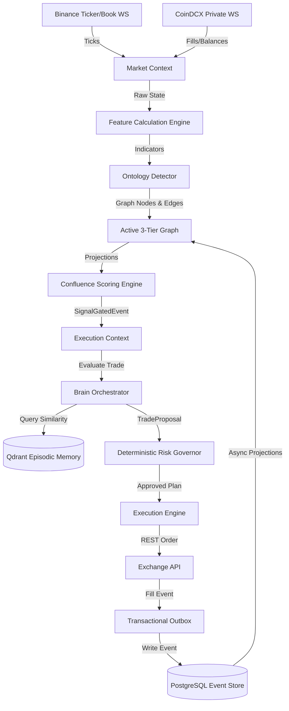

# JDS-000: Janus Platform Overview & System Architecture
Version: 1.0
Status: Approved
Author: Principal Enterprise Architect

## 1. Executive Summary & Vision
Janus is an event-sourced, domain-driven, and ontology-guided Market Operating System (MOS) designed to support autonomous algorithmic trading in crypto futures. The system represents a paradigm shift from traditional, static indicator-based bots to an adaptive, regime-aware platform where market structures are treated as semantic graph elements, and trading workflows are governed by an AI-assisted deterministic pipeline.

By combining low-latency market data processing with a polymorphic market ontology graph and a multi-agent AI brain, Janus provides institutional-grade trade execution, risk management, and self-learning capabilities.

## 2. Core Architectural Pillars

### 2.1 Domain-Driven Design (DDD)
Janus is architected using strict Bounded Contexts to preserve logical boundaries and state invariants. The business capabilities are organized into 7 contexts (Market, Strategy, Execution, Risk, Portfolio, Brain, Research). Aggregates within these contexts ensure transaction consistency, and all communications are mediated using explicit, immutable commands, queries, and domain events.

### 2.2 Event Sourcing & CQRS
All state modifications are persisted as an append-only stream of immutable events (Write Model). Replaying these events reconstructs the state of any aggregate (e.g., `TradeWorkflow` or `Portfolio`). The Query side (Read Model) is separated through asynchronous projections, feeding real-time user interfaces and low-latency decision loops with highly optimized databases (Redis, Postgres read views, and Qdrant).

### 2.3 Semantic Market Ontology
Rather than analyzing markets solely as raw time-series numeric vectors, Janus structures price action into a semantic graph. Market features (CVD, spread, imbalance) and structural objects (Order Blocks, Fair Value Gaps, Liquidity Pools) are classified into hierarchies and linked via typed relationships. This strategy-agnostic ontology allows the trading system to reason about the market in the same way professional human traders do.

### 2.4 Governed ReAct Loop (Hybrid AI/Deterministic Execution)
The platform integrates a local multi-agent LLM Brain orchestrator (via Ollama) to build market narratives, analyze regimes, search episodic memory, and propose execution adjustments. To guarantee safety:
- The LLM Brain is strictly read-only and has no direct access to exchange APIs.
- The LLM Brain cannot mutate trading rules directly.
- The LLM Brain communicates only by emitting structured "Proposals" to a **Deterministic Governor** (the Policy Engine) which validates them against hard risk guidelines before orders are dispatched.

## 3. High-Level Architecture Diagram

## 4. Key Execution Pipelines

1. **The Ingestion Pipeline**: WebSocket connection handles Level 2 depth and trade feeds, calculating Cumulative Volume Delta (CVD) and spread volatility in < 1ms.
2. **The Ontology Detection Pipeline**: Evaluates closed candles to construct Fair Value Gaps (FVG), Order Blocks (OB), and Sweeps, injecting them into the runtime graph projection.
3. **The Autonomous Execution Loop**: Gates signals based on multi-timeframe confluence scoring (Micro + Intra + Swing). Vets signals through the 5-agent LLM brain, checks policies via the Deterministic Governor, executes orders, and starts the `TradeWorkflow` state machine.
4. **The Episodic Learning Loop**: Runs offline post-trade reflection, embedding narratives and PnL metrics to Qdrant memory, which serves as a long-term reference for future trading plans.

---

## 5. Specification Directory Index

The Janus Domain Specification is organized into five logical modules:

### Section 0: The Compiler & DSL
* **[`000-overview.md`](file:///home/nemesis/project/trading-workspace/janus/docs/janus-spec/000-overview.md)**: Executive Summary and Bounded Context maps.
* **[`000.1-specification-language.md`](file:///home/nemesis/project/trading-workspace/janus/docs/janus-spec/000.1-specification-language.md)**: DSL syntax, keywords, namespaces, and import rules.
* **[`000.2-financial-kernel-specification.md`](file:///home/nemesis/project/trading-workspace/janus/docs/janus-spec/000.2-financial-kernel-specification.md)**: Cascading Knowledge Graph layer models (Observation, Inference, Knowledge, Decision).
* **[`000.3-meta-model-specification.md`](file:///home/nemesis/project/trading-workspace/janus/docs/janus-spec/000.3-meta-model-specification.md)**: Domain-agnostic Meta-model primitives (Concept, Observation, Inference, Knowledge, Decision).
* **[`000.4-metaconstraint-logic-expression.md`](file:///home/nemesis/project/trading-workspace/janus/docs/janus-spec/000.4-metaconstraint-logic-expression.md)**: Abstract Syntax Tree grammar for evaluating and validating constraint physics.
* **[`000.5-concept-model.md`](file:///home/nemesis/project/trading-workspace/janus/docs/janus-spec/000.5-concept-model.md)**: The 5 Epistemological stages statechart models.
* **[`kernel.schema.json`](file:///home/nemesis/project/trading-workspace/janus/specs/kernel.schema.json)**: Language-agnostic JSON Schema defining the Janus Financial Kernel model.
* **[`001-compiler-architecture.md`](file:///home/nemesis/project/trading-workspace/janus/docs/janus-spec/001-compiler-architecture.md)**: Lexer, Parser, AST, and Backend decoupling pipeline.
* **[`002-intermediate-representation.md`](file:///home/nemesis/project/trading-workspace/janus/docs/janus-spec/002-intermediate-representation.md)**: Technology-agnostic JIR AST schema formats.
* **[`003-generator-model.md`](file:///home/nemesis/project/trading-workspace/janus/docs/janus-spec/003-generator-model.md)**: Generator outputs mapping JIR to types, zod schemas, Vitest property-tests, and docs.
* **[`004-verification-pipeline.md`](file:///home/nemesis/project/trading-workspace/janus/docs/janus-spec/004-verification-pipeline.md)**: Compile-time semantic analysis, reachability checks, and causality cycle detection.

### Section I: Language & Ontology
* **[`005-ubiquitous-language.md`](file:///home/nemesis/project/trading-workspace/janus/docs/janus-spec/005-ubiquitous-language.md)**: Comprehensive business dictionary across contexts.
* **[`006-bounded-contexts.md`](file:///home/nemesis/project/trading-workspace/janus/docs/janus-spec/006-bounded-contexts.md)**: Context boundaries, aggregate roots, and context dependencies.
* **[`007-market-ontology.md`](file:///home/nemesis/project/trading-workspace/janus/docs/janus-spec/007-market-ontology.md)**: Strategy-agnostic ontology levels specifications.
* **[`007.1-object-taxonomy.md`](file:///home/nemesis/project/trading-workspace/janus/docs/janus-spec/007.1-object-taxonomy.md)**: Organizes subclasses of passive MarketObject facts.
* **[`007.2-object-meta-model.md`](file:///home/nemesis/project/trading-workspace/janus/docs/janus-spec/007.2-object-meta-model.md)**: Properties of entities (geometry, duration, dependencies).
* **[`007.3-object-lifecycle-model.md`](file:///home/nemesis/project/trading-workspace/janus/docs/janus-spec/007.3-object-lifecycle-model.md)**: Lifecycle Algebra, state charts, and temporal decay parameters.
* **[`007.4-object-facet-model.md`](file:///home/nemesis/project/trading-workspace/janus/docs/janus-spec/007.4-object-facet-model.md)**: Multidimensional facet signature matrices.
* **[`007.5-affordance-model.md`](file:///home/nemesis/project/trading-workspace/janus/docs/janus-spec/007.5-affordance-model.md)**: Module bridge between physical structure and execution logic.

### Section II: Behavior & Events
* **[`008-system-model.md`](file:///home/nemesis/project/trading-workspace/janus/docs/janus-spec/008-system-model.md)**: ECS pipeline compile flow and stateless system contracts.
* **[`009.1-interaction-model.md`](file:///home/nemesis/project/trading-workspace/janus/docs/janus-spec/009.1-interaction-model.md)**: Dynamic spatiotemporal events between objects.
* **[`009.2-relationship-meta-model.md`](file:///home/nemesis/project/trading-workspace/janus/docs/janus-spec/009.2-relationship-meta-model.md)**: Decoupled relationship entities (confidence, evidence, provenance).
* **[`009.3-relationship-lifecycle.md`](file:///home/nemesis/project/trading-workspace/janus/docs/janus-spec/009.3-relationship-lifecycle.md)**: Relationship edge statechart lifecycle.
* **[`009.4-relationship-taxonomy.md`](file:///home/nemesis/project/trading-workspace/janus/docs/janus-spec/009.4-relationship-taxonomy.md)**: Graph edge families taxonomy mapping.
* **[`009.5-relationship-affordances.md`](file:///home/nemesis/project/trading-workspace/janus/docs/janus-spec/009.5-relationship-affordances.md)**: Compound relationship affordance descriptors.
* **[`010-domain-physics.md`](file:///home/nemesis/project/trading-workspace/janus/docs/janus-spec/010-domain-physics.md)**: The 11 physical/temporal laws of the market universe.
* **[`011-event-model.md`](file:///home/nemesis/project/trading-workspace/janus/docs/janus-spec/011-event-model.md)**: Envelope schema, namespaces, and generated event catalog.

### Section III: Math & Risk
* **[`013-mathematical-model.md`](file:///home/nemesis/project/trading-workspace/janus/docs/janus-spec/013-mathematical-model.md)**: Quantitative time-series formula mappings (ATR, CVD, OI).
* **[`014-scoring-models.md`](file:///home/nemesis/project/trading-workspace/janus/docs/janus-spec/014-scoring-models.md)**: Composite confluence signal scoring models.
* **[`015-risk-models.md`](file:///home/nemesis/project/trading-workspace/janus/docs/janus-spec/015-risk-models.md)**: fractional Kelly criterion sizing and SL slippage mitigation curves.

### Section IV & V: Architecture & Engineering
* **[`016-cqrs-and-projections.md`](file:///home/nemesis/project/trading-workspace/janus/docs/janus-spec/016-cqrs-and-projections.md)**: Projection mappings to Read models.
* **[`017-event-sourcing-and-outbox.md`](file:///home/nemesis/project/trading-workspace/janus/docs/janus-spec/017-event-sourcing-and-outbox.md)**: Append-only event store and outbox table structures.
* **[`018-storage-and-graph-tiers.md`](file:///home/nemesis/project/trading-workspace/janus/docs/janus-spec/018-storage-and-graph-tiers.md)**: Hot (Graphology) / Warm (RedisJSON) / Cold (Postgres) graph tiers.
* **[`020-temporal-model.md`](file:///home/nemesis/project/trading-workspace/janus/docs/janus-spec/020-temporal-model.md)**: Clock synchronizations across environments.
* **[`021-api-contracts.md`](file:///home/nemesis/project/trading-workspace/janus/docs/janus-spec/021-api-contracts.md)**: tRPC routing and Hono controllers contracts.
* **[`022-versioning-and-schema-evolution.md`](file:///home/nemesis/project/trading-workspace/janus/docs/janus-spec/022-versioning-and-schema-evolution.md)**: Schema evolution, migrations, and upcaster rules.
* **[`023-testing-strategy.md`](file:///home/nemesis/project/trading-workspace/janus/docs/janus-spec/023-testing-strategy.md)**: Replay tests and formal property validation.
* **[`024-promotion-pipeline.md`](file:///home/nemesis/project/trading-workspace/janus/docs/janus-spec/024-promotion-pipeline.md)**: Strategy verification gates.
* **[`025-adr-template.md`](file:///home/nemesis/project/trading-workspace/janus/docs/janus-spec/025-adr-template.md)**: Architectural Decision Records index.
* **[`026-spec-compiler-pipeline.md`](file:///home/nemesis/project/trading-workspace/janus/docs/janus-spec/026-spec-compiler-pipeline.md)**: Toolchain compiler pipeline execution models.
\n