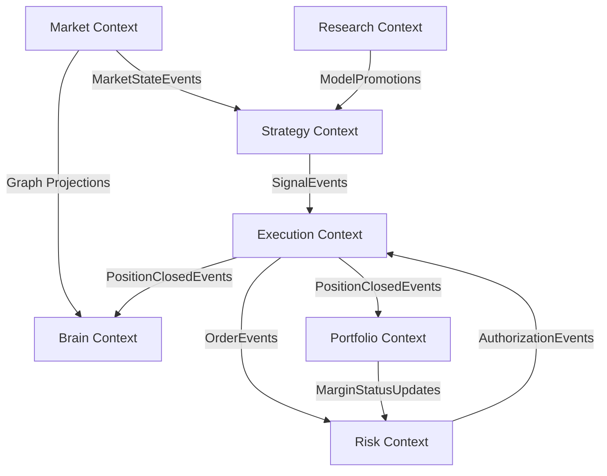

# JDS-002: Bounded Contexts & Relationships Map
Version: 1.0
Status: Approved

Janus is structured into 7 distinct Bounded Contexts. This document establishes boundaries, aggregate roots, dependencies, and integration interfaces.

## 1. Context Map Diagram

---

## 2. Bounded Context Specifications

### 2.1 Market Context
- **Boundary**: Ingests exchange L2 order books, tick data feeds, and private exchange position streams. Standardizes data feeds, calculates technical and volume features, identifies structural levels (`MarketObjects`), and exposes the 3-Tier Graph.
- **Aggregate Roots**: `MarketStateAggregate`
- **Entities**: `MarketObject` (and children), `OrderBook`
- **Value Objects**: `Tick`, `FeatureMap`, `Edge`
- **Inbound Signals**: Raw REST and WebSockets from Binance & CoinDCX.
- **Outbound Events**: `MarketDataReceived`, `FairValueGapDetected`, `OrderBlockDetected`, `LiquiditySwept`.
- **Dependencies**: None.

### 2.2 Strategy Context
- **Boundary**: Configures trading strategies. Scores symbols at regular time intervals (30s) combining micro, intra, and swing signals into a composite score. Gates signal dispatch based on configured rules.
- **Aggregate Roots**: `StrategyAggregate`
- **Entities**: `Signal`
- **Value Objects**: `RuleDefinition`, `ConfluenceScore`
- **Inbound Events**: `MarketDataReceived`, `OrderBlockDetected`, `FairValueGapDetected`.
- **Outbound Events**: `SignalGated`.
- **Dependencies**: Downstream of `Market Context`.

### 2.3 Execution Context
- **Boundary**: Governs the entry, tracking, stop-loss protection, trailing stop execution, and exit of individual positions. Executes the `TradeWorkflow` state machine.
- **Aggregate Roots**: `TradeWorkflow`
- **Entities**: `Position`, `Order`
- **Value Objects**: `ExecutionPlan`, `Trade`
- **Inbound Events**: `SignalGated`, `RiskAuthorizationGranted`, `RiskAuthorizationDenied`.
- **Outbound Events**: `TradeWorkflowStarted`, `OrderSubmitted`, `PositionOpened`, `TrailingStopUpdated`, `TradeWorkflowClosed`.
- **Dependencies**: Downstream of `Strategy Context` and upstream of `Risk Context`.

### 2.4 Risk Context
- **Boundary**: Operates as the Deterministic Governor. Evaluates active exposures, daily drawdowns, and market regime spreads. Authorizes or rejects execution plans before they touch exchange adapters. Includes the emergency heuristic Kill Switch.
- **Aggregate Roots**: `RiskProfileAggregate`
- **Entities**: `KillSwitchState`, `SafetyGate`
- **Value Objects**: `RiskScore`, `LimitCheck`
- **Inbound Events**: `TradeWorkflowStarted`, `OrderSubmitted`, `MarginStatusUpdates`.
- **Outbound Events**: `RiskAuthorizationGranted`, `RiskAuthorizationDenied`, `RiskThresholdBreached`, `KillSwitchTriggered`.
- **Dependencies**: Downstream of `Execution Context` and `Portfolio Context`.

### 2.5 Portfolio Context
- **Boundary**: Manages total account balance, isolated and cross margin allocations, commissions, exchange fees, and hourly funding fees. Periodically reconciles positions with the remote exchange.
- **Aggregate Roots**: `PortfolioAggregate`
- **Entities**: `AccountBalance`, `HistoricalTrade`
- **Value Objects**: `FundingFee`, `SlippageMetric`
- **Inbound Events**: `PositionOpened`, `TradeWorkflowClosed`.
- **Outbound Events**: `MarginStatusUpdates`, `ReconciliationCompleted`.
- **Dependencies**: Upstream of `Risk Context`.

### 2.6 Brain Context
- **Boundary**: Coordinates the multi-agent LLM reasoning pipeline. Builds semantic market narratives, compiles post-trade reflections, encodes episodes into high-dimensional vector representations, and queries Qdrant memory.
- **Aggregate Roots**: `BrainEpisodeAggregate`
- **Entities**: `Episode`, `MarketNarrative`
- **Value Objects**: `Reflection`, `SemanticEmbedding`
- **Inbound Events**: `SignalGated`, `TradeWorkflowClosed`.
- **Outbound Events**: `BrainPlanProposed`, `EpisodeReflected`.
- **Dependencies**: Upstream of `Risk Context` (submits proposals) and downstream of `Market`, `Execution` and `Portfolio` contexts.

### 2.7 Research Context
- **Boundary**: Runs offline backtesting simulation suites, triggers genetic parameter optimizations, and recommends rules update parameters to the Strategy context.
- **Aggregate Roots**: `BacktestSuite`
- **Entities**: `SimulationResult`, `CandidateRule`
- **Value Objects**: `BacktestReport`
- **Inbound Events**: `EpisodeReflected`.
- **Outbound Events**: `ModelPromotions`.
- **Dependencies**: Read-only access to historical events from the PostgreSQL database.\n