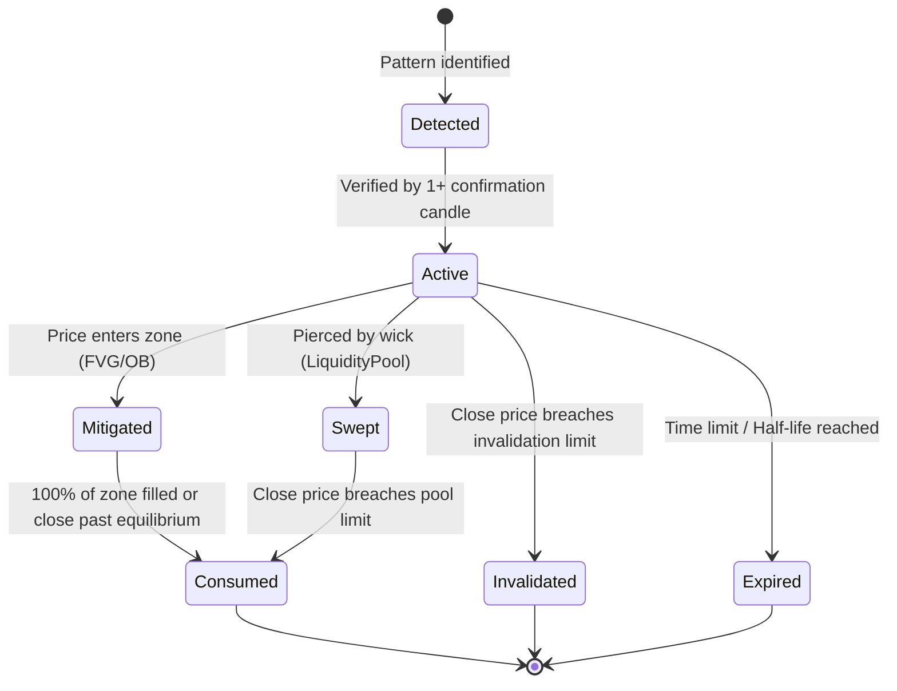

# JDS-003.3: Object Lifecycle & Decay Model
Version: 1.0
Status: Approved

This document specifies the lifecycle states and decay formulas for MarketObjects.

## 1. Lifecycle State Diagram

---

## 2. Lifecycle States

1. **Detected**: An anomaly pattern is identified on candle close, but has not yet survived a confirmation filter.
2. **Active**: Level is confirmed and active in the 3-Tier graph. Ready to gate signals or guide entry positions.
3. **Swept**: Price wicks have crossed the boundary, triggering liquidity events, but the body has not closed past the limit.
4. **Mitigated**: Price has partially filled the zone. The remaining active space is recalculated.
5. **Consumed**: The structure has been fully filled or violated by a body close, removing it from active queries.
6. **Invalidated**: The invalidation criteria have been met (e.g. price closed past the invalidation price boundary).
7. **Expired**: The structure has decayed past its maximum candle age and is pruned to optimize memory.

---

## 3. Temporal Decay Formula
The relevance of an active level decays over time according to an exponential decay function:

$$	ext{Relevance}(t) = 	ext{Confidence}_0 	imes e^{-\lambda (t - t_0)}$$

Where:
- $	ext{Confidence}_0$ is the initial confidence score (0.0 to 1.0).
- $t - t_0$ is the age of the level in elapsed candles.
- $\lambda$ is the decay constant, calculated based on the timeframe:

$$\lambda = rac{\ln(2)}{	ext{HalfLifeCandles}}$$

Levels are automatically pruned when $	ext{Relevance}(t) < 0.20$.\n